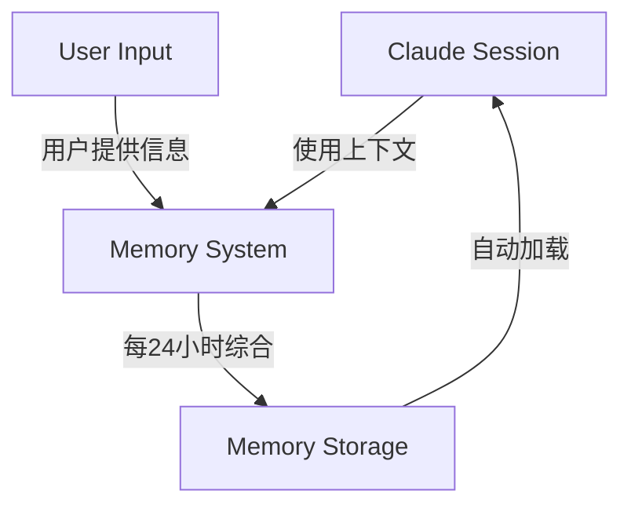
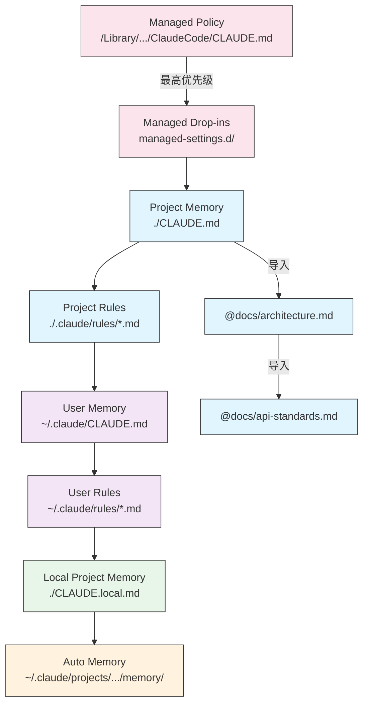
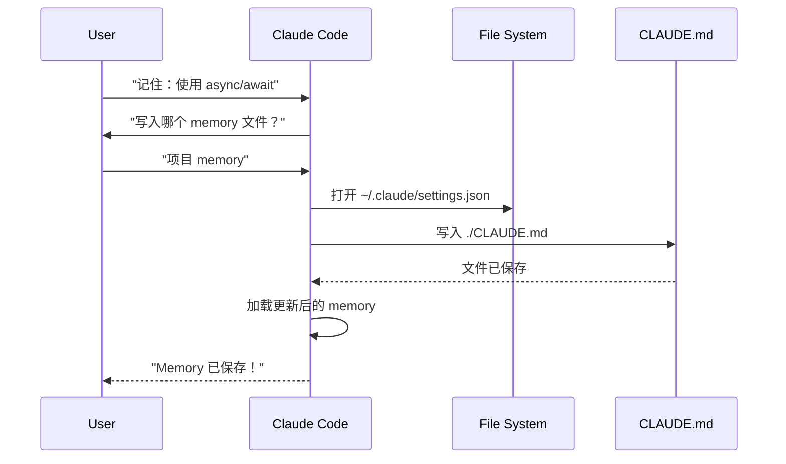
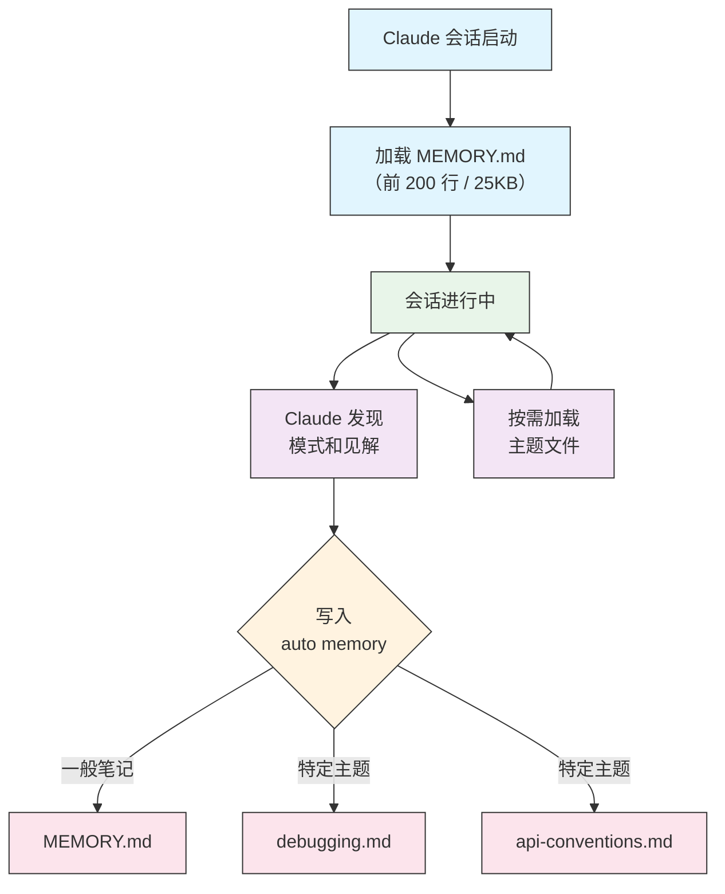

<picture>
  <source media="(prefers-color-scheme: dark)" srcset="../../resources/logos/claude-howto-logo-dark.svg">
  
</picture>

# Memory 指南

Memory 让 Claude 能够在会话和对话之间保留上下文。它有两种形式：claude.ai 上的自动综合（auto synthesis），以及 Claude Code 中基于文件系统的 CLAUDE.md。

## 概览

Claude Code 中的 Memory 提供了跨会话、跨对话的持久化上下文。与临时的上下文窗口不同，memory 文件让你可以：

- 在团队中共享项目规范
- 存储个人开发偏好
- 维护目录级别的规则和配置
- 导入外部文档
- 将 memory 作为项目的一部分进行版本控制

Memory 系统在多个层级上运作，从全局个人偏好一直到特定子目录，允许你对 Claude 记住什么以及如何应用这些知识进行精细控制。

## Memory 命令速查

| 命令 | 作用 | 用法 | 什么时候用 |
|------|------|-----|-----------|
| `/init` | 初始化项目 memory | `/init` | 开始新项目、首次配置 CLAUDE.md |
| `/memory` | 在编辑器中编辑 memory 文件 | `/memory` | 大量更新、重新组织、审查内容 |
| `#` 前缀 | ~~快速单行添加 memory~~ **已废弃** | — | 改用 `/memory` 或对话式请求 |
| `@path/to/file` | 导入外部内容 | `@README.md` 或 `@docs/api.md` | 在 CLAUDE.md 中引用已有文档 |

## 快速上手：初始化 Memory

### `/init` 命令

`/init` 是在 Claude Code 中设置项目 memory 最快的方式。它会创建一个 CLAUDE.md 文件，包含基础的项目文档。

**用法：**

```bash
/init
```

**它会做什么：**

- 在你的项目中创建新的 CLAUDE.md 文件（通常在 `./CLAUDE.md` 或 `./.claude/CLAUDE.md`）
- 建立项目约定和规范
- 为跨会话的上下文持久化打好基础
- 提供模板结构来记录你的项目标准

**增强交互模式：** 设置 `CLAUDE_CODE_NEW_INIT=1` 可以启用多阶段交互流程，逐步引导你完成项目配置：

```bash
CLAUDE_CODE_NEW_INIT=1 claude
/init
```

**什么时候用 `/init`：**

- 用 Claude Code 开始一个新项目
- 建立团队编码标准和约定
- 创建关于代码库结构的文档
- 为协作开发设置 memory 层级

**示例流程：**

```markdown
# 在你的项目目录中
/init

# Claude 创建 CLAUDE.md，结构类似：
# Project Configuration
## Project Overview
- Name: Your Project
- Tech Stack: [Your technologies]
- Team Size: [Number of developers]

## Development Standards
- Code style preferences
- Testing requirements
- Git workflow conventions
```

### 快速更新 Memory

> **注意**：用于内联 memory 的 `#` 快捷方式已废弃。请使用 `/memory` 直接编辑 memory 文件，或者对话式地要求 Claude 记住某些内容（例如 "记住我们总是使用 TypeScript strict mode"）。

推荐的 memory 信息添加方式：

**方式 1：使用 `/memory` 命令**

```bash
/memory
```

在你的系统编辑器中打开 memory 文件进行直接编辑。

**方式 2：对话式请求**

```
记住这个项目我们总是使用 TypeScript strict mode。
请添加到 memory：优先使用 async/await 而不是 promise 链。
```

Claude 会根据你的请求更新对应的 CLAUDE.md 文件。

**历史参考**（已不再可用）：

`#` 前缀快捷方式以前允许内联添加规则：

```markdown
# Always use TypeScript strict mode in this project  ← 已不再生效
```

如果你之前依赖这个方式，请改用 `/memory` 命令或对话式请求。

### `/memory` 命令

`/memory` 命令让你在 Claude Code 会话中直接编辑 CLAUDE.md memory 文件。它会在你的系统编辑器中打开 memory 文件，方便你进行全面编辑。

**用法：**

```bash
/memory
```

**它会做什么：**

- 在系统默认编辑器中打开 memory 文件
- 允许你进行大量的添加、修改和重新组织
- 提供对层级中所有 memory 文件的直接访问
- 让你管理跨会话的持久化上下文

**什么时候用 `/memory`：**

- 审查已有的 memory 内容
- 对项目标准进行大量更新
- 重新组织 memory 结构
- 添加详细的文档或规范
- 随着项目演进维护和更新 memory

**对比：`/memory` vs `/init`**

| 方面 | `/memory` | `/init` |
|------|-----------|---------|
| **用途** | 编辑已有 memory 文件 | 初始化新的 CLAUDE.md |
| **什么时候用** | 更新/修改项目上下文 | 开始新项目 |
| **动作** | 打开编辑器进行修改 | 生成起始模板 |
| **工作流** | 持续维护 | 一次性设置 |

**示例流程：**

```markdown
# 打开 memory 进行编辑
/memory

# Claude 展示选项：
# 1. Managed Policy Memory
# 2. Project Memory (./CLAUDE.md)
# 3. User Memory (~/.claude/CLAUDE.md)
# 4. Local Project Memory

# 选择选项 2 (Project Memory)
# 你的默认编辑器打开 ./CLAUDE.md 内容

# 进行修改，保存，关闭编辑器
# Claude 自动重新加载更新后的 memory
```

**使用 Memory 导入：**

CLAUDE.md 文件支持 `@path/to/file` 语法来引入外部内容：

```markdown
# Project Documentation
See @README.md for project overview
See @package.json for available npm commands
See @docs/architecture.md for system design

# 使用绝对路径从主目录导入
@~/.claude/my-project-instructions.md
```

**导入功能：**

- 支持相对路径和绝对路径（例如 `@docs/api.md` 或 `@~/.claude/my-project-instructions.md`）
- 支持递归导入，最大深度为 5 层
- 首次从外部位置导入时会触发安全审批对话框
- 导入指令不会在 markdown 行内代码或代码块中被解析（所以在示例中写它们是安全的）
- 通过引用已有文档来避免重复
- 自动将引用的内容纳入 Claude 的上下文

## Memory 架构

Claude Code 中的 memory 遵循层级系统，不同的作用域服务于不同目的：



## Claude Code 中的 Memory 层级

Claude Code 使用多层级的 memory 系统。Memory 文件在 Claude Code 启动时自动加载，层级越高的文件优先级越高。

**完整 Memory 层级（按优先级排序）：**

1. **Managed Policy** — 组织级指令
   - macOS: `/Library/Application Support/ClaudeCode/CLAUDE.md`
   - Linux/WSL: `/etc/claude-code/CLAUDE.md`
   - Windows: `C:\Program Files\ClaudeCode\CLAUDE.md`

2. **Managed Drop-ins** — 按字母顺序合并的策略文件 (v2.1.83+)
   - managed policy CLAUDE.md 旁边的 `managed-settings.d/` 目录
   - 文件按字母顺序合并，用于模块化策略管理

3. **Project Memory** — 团队共享上下文（版本控制）
   - `./.claude/CLAUDE.md` 或 `./CLAUDE.md`（在仓库根目录）

4. **Project Rules** — 模块化、按主题划分的项目指令
   - `./.claude/rules/*.md`

5. **User Memory** — 个人偏好（所有项目）
   - `~/.claude/CLAUDE.md`

6. **User-Level Rules** — 个人规则（所有项目）
   - `~/.claude/rules/*.md`

7. **Local Project Memory** — 个人的项目专属偏好
   - `./CLAUDE.local.md`

> **注意**：`CLAUDE.local.md` 在[官方文档](https://code.claude.com/docs/en/memory)中有完整说明。它用于存储不提交到版本控制的个人项目专属偏好。请将 `CLAUDE.local.md` 加入 `.gitignore`。

8. **Auto Memory** — Claude 的自动笔记和学习记录
   - `~/.claude/projects/<project>/memory/`

**Memory 发现行为：**

Claude 按以下顺序搜索 memory 文件，越靠前的位置优先级越高：



## 用 `claudeMdExcludes` 排除 CLAUDE.md 文件

在大型 monorepo 中，有些 CLAUDE.md 文件可能跟你当前的工作无关。`claudeMdExcludes` 设置可以让你跳过特定的 CLAUDE.md 文件，不让它们被加载到上下文中：

```jsonc
// 在 ~/.claude/settings.json 或 .claude/settings.json 中
{
  "claudeMdExcludes": [
    "packages/legacy-app/CLAUDE.md",
    "vendors/**/CLAUDE.md"
  ]
}
```

模式匹配是相对于项目根目录的路径。特别适用于以下场景：

- 有多个子项目的 monorepo，其中只有部分跟你相关
- 包含第三方或供应商 CLAUDE.md 文件的仓库
- 通过排除过时或无关的指令来减少 Claude 上下文窗口中的噪声

## 配置文件层级

Claude Code 的设置（包括 `autoMemoryDirectory`、`claudeMdExcludes` 等）从五个层级进行解析，层级越高优先级越高：

| 层级 | 位置 | 作用范围 |
|------|------|---------|
| 1（最高） | Managed policy（系统级） | 组织级强制执行 |
| 2 | `managed-settings.d/` (v2.1.83+) | 模块化策略 drop-ins，按字母顺序合并 |
| 3 | `~/.claude/settings.json` | 用户偏好 |
| 4 | `.claude/settings.json` | 项目级（提交到 git） |
| 5（最低） | `.claude/settings.local.json` | 本地覆盖（git 忽略） |

**平台特定配置 (v2.1.51+)：**

设置还可以通过以下方式配置：
- **macOS**：Property list (plist) 文件
- **Windows**：Windows 注册表

这些平台原生机制与 JSON 设置文件一起读取，遵循相同的优先级规则。

> **注意 (v2.1.119)**：`/config` 的修改现在会持久化到 `~/.claude/settings.json`。通过 `/config` 写入的值会参与上面描述的项目/本地/策略优先级链——它们不再是仅限当前会话的。交互式编辑用 `/config`，脚本化或托管配置直接编辑 `settings.json` 文件。

### 保留和清理设置

| 设置 | 类型 | 默认值 | 说明 |
|------|------|--------|------|
| `cleanupPeriodDays` | integer（天数） | 30 | 磁盘上产物的保留窗口。**从 v2.1.117 起**，它适用于以下全部四项：checkpoints（`~/.claude/checkpoints/`）、tasks（`~/.claude/tasks/`）、shell-snapshots（`~/.claude/shell-snapshots/`）和 backups（`~/.claude/backups/`）。超过保留窗口的文件会在启动时被清理。 |

```jsonc
// ~/.claude/settings.json
{
  "cleanupPeriodDays": 14
}
```

### 归因、语音和 PR URL 设置

| 设置 | 类型 | 说明 |
|------|------|------|
| `attribution.commit` | boolean | 在 Claude 创建的 commit 中添加 `Co-Authored-By: Claude` 尾部。取代已废弃的 `includeCoAuthoredBy` 标志。 |
| `attribution.pr` | boolean | 在 PR 描述中添加 Claude 归因。取代用于 PR 的已废弃 `includeCoAuthoredBy` 标志。 |
| `voice.enabled` | boolean | 启用按键说话的语音输入（`/voice`）。取代已废弃的 `voiceEnabled` 标志。 |
| `prUrlTemplate` | string | **v2.1.119 新增。** 页脚 PR 徽章的自定义 URL 模板；适用于 GitLab、Bitbucket 或内部代码审查平台。支持 `{{owner}}`、`{{repo}}` 和 `{{number}}` 占位符。 |

```jsonc
// ~/.claude/settings.json
{
  "attribution": {
    "commit": false,
    "pr": true
  },
  "voice": {
    "enabled": true
  },
  "prUrlTemplate": "https://gitlab.internal/{{owner}}/{{repo}}/-/merge_requests/{{number}}"
}
```

#### 已废弃的设置名称

以下旧版设置键仍然可用但已废弃。请优先使用上面的替代项。

| 已废弃的键 | 替代项 | 说明 |
|------------|--------|------|
| `includeCoAuthoredBy` | `attribution.commit` / `attribution.pr` | 旧的单个标志被拆分为独立的 commit 和 PR 开关。旧版安装可以继续使用旧键；新项目应使用嵌套形式。 |
| `voiceEnabled` | `voice.enabled` | 归入 `voice` 命名空间，与未来的语音相关选项并列。 |

## 模块化规则系统

使用 `.claude/rules/` 目录结构创建有组织的、按路径划分的规则。规则可以在项目级和用户级两个层面定义：

```
your-project/
├── .claude/
│   ├── CLAUDE.md
│   └── rules/
│       ├── code-style.md
│       ├── testing.md
│       ├── security.md
│       └── api/                  # 支持子目录
│           ├── conventions.md
│           └── validation.md

~/.claude/
├── CLAUDE.md
└── rules/                        # 用户级规则（所有项目）
    ├── personal-style.md
    └── preferred-patterns.md
```

规则会在 `rules/` 目录中被递归发现，包括所有子目录。用户级规则 `~/.claude/rules/` 在项目级规则之前加载，允许个人默认设置被项目覆盖。

### 通过 YAML Frontmatter 设置路径专属规则

定义仅适用于特定文件路径的规则：

```markdown
---
paths: src/api/**/*.ts
---

# API Development Rules

- All API endpoints must include input validation
- Use Zod for schema validation
- Document all parameters and response types
- Include error handling for all operations
```

**Glob 模式示例：**

- `**/*.ts` — 所有 TypeScript 文件
- `src/**/*` — src/ 下的所有文件
- `src/**/*.{ts,tsx}` — 多种扩展名
- `{src,lib}/**/*.ts, tests/**/*.test.ts` — 多个模式

### 子目录和符号链接

`.claude/rules/` 中的规则支持两种组织特性：

- **子目录**：规则会被递归发现，所以你可以按主题将它们组织到文件夹中（例如 `rules/api/`、`rules/testing/`、`rules/security/`）
- **符号链接**：支持通过符号链接在多个项目之间共享规则。例如，你可以从中心位置将共享规则文件符号链接到每个项目的 `.claude/rules/` 目录中

## Memory 位置一览表

| 位置 | 作用范围 | 优先级 | 是否共享 | 访问方式 | 最适合 |
|------|---------|--------|---------|---------|--------|
| `/Library/Application Support/ClaudeCode/CLAUDE.md` (macOS) | Managed Policy | 1（最高） | 组织 | 系统 | 公司级策略 |
| `/etc/claude-code/CLAUDE.md` (Linux/WSL) | Managed Policy | 1（最高） | 组织 | 系统 | 组织标准 |
| `C:\Program Files\ClaudeCode\CLAUDE.md` (Windows) | Managed Policy | 1（最高） | 组织 | 系统 | 企业规范 |
| `managed-settings.d/*.md`（与 policy 并列） | Managed Drop-ins | 1.5 | 组织 | 系统 | 模块化策略文件 (v2.1.83+) |
| `./CLAUDE.md` 或 `./.claude/CLAUDE.md` | Project Memory | 2 | 团队 | Git | 团队标准、共享架构 |
| `./.claude/rules/*.md` | Project Rules | 3 | 团队 | Git | 按路径划分的模块化规则 |
| `~/.claude/CLAUDE.md` | User Memory | 4 | 个人 | 文件系统 | 个人偏好（所有项目） |
| `~/.claude/rules/*.md` | User Rules | 5 | 个人 | 文件系统 | 个人规则（所有项目） |
| `./CLAUDE.local.md` | Project Local | 6 | 个人 | Git（忽略） | 个人的项目专属偏好 |
| `~/.claude/projects/<project>/memory/` | Auto Memory | 7（最低） | 个人 | 文件系统 | Claude 的自动笔记和学习记录 |

## Memory 更新生命周期

Memory 更新在你的 Claude Code 会话中是这样流转的：



## Auto Memory

Auto memory 是一个持久化目录，Claude 在处理你的项目时会自动记录学习成果、模式和见解。与 CLAUDE.md 文件（由你手动编写和维护）不同，auto memory 是 Claude 在会话过程中自己写入的。

### Auto Memory 如何工作

- **位置**：`~/.claude/projects/<project>/memory/`
- **入口文件**：`MEMORY.md` 作为 auto memory 目录的主文件
- **主题文件**：可选的附加文件，用于特定主题（例如 `debugging.md`、`api-conventions.md`）
- **加载行为**：会话启动时加载 `MEMORY.md` 的前 200 行（或前 25KB，以先到者为准）。主题文件按需加载，不在启动时加载。
- **读写**：Claude 在会话中发现模式和项目特定知识时，会读写 memory 文件

### Auto Memory 架构



### Auto Memory 目录结构

```
~/.claude/projects/<project>/memory/
├── MEMORY.md              # 入口文件（启动时加载前 200 行 / 25KB）
├── debugging.md           # 主题文件（按需加载）
├── api-conventions.md     # 主题文件（按需加载）
└── testing-patterns.md    # 主题文件（按需加载）
```

### 版本要求

Auto memory 需要 **Claude Code v2.1.59 或更高版本**。如果你使用的是旧版本，请先升级：

```bash
npm install -g @anthropic-ai/claude-code@latest
```

### 自定义 Auto Memory 目录

默认情况下，auto memory 存储在 `~/.claude/projects/<project>/memory/`。你可以使用 `autoMemoryDirectory` 设置（**v2.1.74** 起可用）来更改此位置：

```jsonc
// 在 ~/.claude/settings.json 或 .claude/settings.local.json 中（仅限用户/本地设置）
{
  "autoMemoryDirectory": "/path/to/custom/memory/directory"
}
```

> **注意**：`autoMemoryDirectory` 只能在用户级（`~/.claude/settings.json`）或本地设置（`.claude/settings.local.json`）中配置，不能在项目或 managed policy 设置中配置。

这在你需要以下场景时很有用：

- 将 auto memory 存储在共享或同步的位置
- 将 auto memory 与默认的 Claude 配置目录分离
- 在默认层级之外使用项目专属路径

### Worktree 和仓库共享

同一 git 仓库中的所有 worktree 和子目录共享同一个 auto memory 目录。这意味着在不同 worktree 之间切换或在同一仓库的不同子目录中工作，都会读写相同的 memory 文件。

### Subagent Memory

Subagent（通过 Task 或并行执行等工具生成的）可以拥有自己的 memory 上下文。使用 subagent 定义中的 `memory` frontmatter 字段来指定要加载哪些 memory 作用域：

```yaml
memory: user      # 仅加载用户级 memory
memory: project   # 仅加载项目级 memory
memory: local     # 仅加载本地 memory
```

这让 subagent 可以在聚焦的上下文中运行，而不是继承完整的 memory 层级。

> **注意**：Subagent 也可以维护自己的 auto memory。详见[官方 subagent memory 文档](https://code.claude.com/docs/en/sub-agents#enable-persistent-memory)。

### 控制 Auto Memory

可以通过 `CLAUDE_CODE_DISABLE_AUTO_MEMORY` 环境变量控制 auto memory：

| 值 | 行为 |
|----|------|
| `0` | 强制**开启** auto memory |
| `1` | 强制**关闭** auto memory |
| *(未设置)* | 默认行为（auto memory 开启） |

```bash
# 在当前会话中禁用 auto memory
CLAUDE_CODE_DISABLE_AUTO_MEMORY=1 claude

# 显式开启 auto memory
CLAUDE_CODE_DISABLE_AUTO_MEMORY=0 claude
```

## 通过 `--add-dir` 添加额外目录

`--add-dir` 标志让 Claude Code 可以从当前工作目录之外的其他目录加载 CLAUDE.md 文件。适用于 monorepo 或多项目场景，当其他目录的上下文也相关时。

启用此功能需要设置环境变量：

```bash
CLAUDE_CODE_ADDITIONAL_DIRECTORIES_CLAUDE_MD=1
```

然后使用该标志启动 Claude Code：

```bash
claude --add-dir /path/to/other/project
```

Claude 会从指定的额外目录加载 CLAUDE.md，同时加载当前工作目录的 memory 文件。

## 实战示例

### 示例 1：项目 Memory 结构

**文件：** `./CLAUDE.md`

```markdown
# Project Configuration

## Project Overview
- **Name**: E-commerce Platform
- **Tech Stack**: Node.js, PostgreSQL, React 18, Docker
- **Team Size**: 5 developers
- **Deadline**: Q4 2025

## Architecture
@docs/architecture.md
@docs/api-standards.md
@docs/database-schema.md

## Development Standards

### Code Style
- Use Prettier for formatting
- Use ESLint with airbnb config
- Maximum line length: 100 characters
- Use 2-space indentation

### Naming Conventions
- **Files**: kebab-case (user-controller.js)
- **Classes**: PascalCase (UserService)
- **Functions/Variables**: camelCase (getUserById)
- **Constants**: UPPER_SNAKE_CASE (API_BASE_URL)
- **Database Tables**: snake_case (user_accounts)

### Git Workflow
- Branch names: `feature/description` or `fix/description`
- Commit messages: Follow conventional commits
- PR required before merge
- All CI/CD checks must pass
- Minimum 1 approval required

### Testing Requirements
- Minimum 80% code coverage
- All critical paths must have tests
- Use Jest for unit tests
- Use Cypress for E2E tests
- Test filenames: `*.test.ts` or `*.spec.ts`

### API Standards
- RESTful endpoints only
- JSON request/response
- Use HTTP status codes correctly
- Version API endpoints: `/api/v1/`
- Document all endpoints with examples

### Database
- Use migrations for schema changes
- Never hardcode credentials
- Use connection pooling
- Enable query logging in development
- Regular backups required

### Deployment
- Docker-based deployment
- Kubernetes orchestration
- Blue-green deployment strategy
- Automatic rollback on failure
- Database migrations run before deploy

## Common Commands

| Command | Purpose |
|---------|---------|
| `npm run dev` | Start development server |
| `npm test` | Run test suite |
| `npm run lint` | Check code style |
| `npm run build` | Build for production |
| `npm run migrate` | Run database migrations |

## Team Contacts
- Tech Lead: Sarah Chen (@sarah.chen)
- Product Manager: Mike Johnson (@mike.j)
- DevOps: Alex Kim (@alex.k)

## Known Issues & Workarounds
- PostgreSQL connection pooling limited to 20 during peak hours
- Workaround: Implement query queuing
- Safari 14 compatibility issues with async generators
- Workaround: Use Babel transpiler

## Related Projects
- Analytics Dashboard: `/projects/analytics`
- Mobile App: `/projects/mobile`
- Admin Panel: `/projects/admin`
```

### 示例 2：目录专属 Memory

**文件：** `./src/api/CLAUDE.md`

````markdown
# API Module Standards

This file overrides root CLAUDE.md for everything in /src/api/

## API-Specific Standards

### Request Validation
- Use Zod for schema validation
- Always validate input
- Return 400 with validation errors
- Include field-level error details

### Authentication
- All endpoints require JWT token
- Token in Authorization header
- Token expires after 24 hours
- Implement refresh token mechanism

### Response Format

All responses must follow this structure:

```json
{
  "success": true,
  "data": { /* actual data */ },
  "timestamp": "2025-11-06T10:30:00Z",
  "version": "1.0"
}
```

Error responses:
```json
{
  "success": false,
  "error": {
    "code": "VALIDATION_ERROR",
    "message": "User message",
    "details": { /* field errors */ }
  },
  "timestamp": "2025-11-06T10:30:00Z"
}
```

### Pagination
- Use cursor-based pagination (not offset)
- Include `hasMore` boolean
- Limit max page size to 100
- Default page size: 20

### Rate Limiting
- 1000 requests per hour for authenticated users
- 100 requests per hour for public endpoints
- Return 429 when exceeded
- Include retry-after header

### Caching
- Use Redis for session caching
- Cache duration: 5 minutes default
- Invalidate on write operations
- Tag cache keys with resource type
````

### 示例 3：个人 Memory

**文件：** `~/.claude/CLAUDE.md`

```markdown
# My Development Preferences

## About Me
- **Experience Level**: 8 years full-stack development
- **Preferred Languages**: TypeScript, Python
- **Communication Style**: Direct, with examples
- **Learning Style**: Visual diagrams with code

## Code Preferences

### Error Handling
I prefer explicit error handling with try-catch blocks and meaningful error messages.
Avoid generic errors. Always log errors for debugging.

### Comments
Use comments for WHY, not WHAT. Code should be self-documenting.
Comments should explain business logic or non-obvious decisions.

### Testing
I prefer TDD (test-driven development).
Write tests first, then implementation.
Focus on behavior, not implementation details.

### Architecture
I prefer modular, loosely-coupled design.
Use dependency injection for testability.
Separate concerns (Controllers, Services, Repositories).

## Debugging Preferences
- Use console.log with prefix: `[DEBUG]`
- Include context: function name, relevant variables
- Use stack traces when available
- Always include timestamps in logs

## Communication
- Explain complex concepts with diagrams
- Show concrete examples before explaining theory
- Include before/after code snippets
- Summarize key points at the end

## Project Organization
I organize my projects as:

   project/
   ├── src/
   │   ├── api/
   │   ├── services/
   │   ├── models/
   │   └── utils/
   ├── tests/
   ├── docs/
   └── docker/

## Tooling
- **IDE**: VS Code with vim keybindings
- **Terminal**: Zsh with Oh-My-Zsh
- **Format**: Prettier (100 char line length)
- **Linter**: ESLint with airbnb config
- **Test Framework**: Jest with React Testing Library
```

_My Test_
Ask Claude to save a new rule


Claude 没有保存规则，因为当时没有任何 `Claude.md` 文件。然后让 Claude 确认位置。


### 示例 4：会话中更新 Memory

你可以在 Claude Code 会话进行中添加新规则到 memory。有两种方式：

#### 方式 1：直接请求

```markdown
User: 记住我偏好在所有新组件中使用 React hooks 而不是 class 组件。

Claude: 我正在把这个添加到你的 memory。应该写入哪个 memory 文件？
       1. 项目 memory (./CLAUDE.md)
       2. 个人 memory (~/.claude/CLAUDE.md)

User: 项目 memory

Claude: ✅ Memory 已保存！

Added to ./CLAUDE.md:
---

### Component Development
- Use functional components with React Hooks
- Prefer hooks over class components
- Custom hooks for reusable logic
- Use useCallback for event handlers
- Use useMemo for expensive computations
```

#### 方式 2：使用 "# new rule into memory" 模式

你也可以使用显式模式 "# new rule into memory" 来触发 memory 更新：

```markdown
User: # new rule into memory
      Always validate user input with Zod schemas before processing.

Claude: 我正在把这条规则保存到 memory。使用哪个 memory 文件？
       1. 项目 memory (./CLAUDE.md)
       2. 个人 memory (~/.claude/CLAUDE.md)

User: 项目 memory

Claude: ✅ Memory 已保存！

Added to ./CLAUDE.md:
---

### Input Validation
- Always validate user input with Zod schemas before processing
- Define schemas at the top of each API handler file
- Return 400 status with validation errors
```

#### 添加 Memory 的小贴士

- 规则要具体且可执行
- 将相关规则归组在一个章节标题下
- 更新已有章节而不是重复内容
- 选择合适的 memory 作用范围（项目 vs. 个人）

## Memory 功能对比

| 功能 | Claude Web/Desktop | Claude Code (CLAUDE.md) |
|------|-------------------|------------------------|
| 自动综合 | ✅ 每24小时 | ✅ Auto memory |
| 跨项目 | ✅ 共享 | ❌ 项目专属 |
| 团队访问 | ✅ 共享项目 | ✅ Git 跟踪 |
| 可搜索 | ✅ 内置 | ✅ 通过 `/memory` |
| 可编辑 | ✅ 对话中 | ✅ 直接编辑文件 |
| 导入/导出 | ✅ 支持 | ✅ 复制粘贴 |
| 持久化 | ✅ 24小时+ | ✅ 无限期 |

### Claude Web/Desktop 中的 Memory

#### Memory 综合时间线


**Memory 总结示例：**

```markdown
## Claude 对用户的记忆

### 职业背景
- 拥有 8 年经验的高级全栈开发者
- 专注于 TypeScript/Node.js 后端和 React 前端
- 活跃的开源贡献者
- 对 AI 和机器学习感兴趣

### 项目背景
- 目前在构建电商平台
- 技术栈：Node.js, PostgreSQL, React 18, Docker
- 与 5 名开发者组成的团队合作
- 使用 CI/CD 和蓝绿部署

### 沟通偏好
- 偏好直接、简洁的解释
- 喜欢图表和示例
- 欣赏代码片段
- 在注释中解释业务逻辑

### 当前目标
- 提升 API 性能
- 将测试覆盖率提升至 90%
- 实现缓存策略
- 编写架构文档
```

## 最佳实践

### 应该做的

- **具体而详细**：使用清晰、详细的指令，而不是模糊的指导
  - ✅ 好的："所有 JavaScript 文件使用 2 空格缩进"
  - ❌ 避免："遵循最佳实践"

- **保持有序**：用清晰的 markdown 章节和标题组织 memory 文件

- **使用合适的层级**：
  - **Managed policy**：公司级策略、安全标准、合规要求
  - **项目 memory**：团队标准、架构、编码约定（提交到 git）
  - **用户 memory**：个人偏好、沟通风格、工具选择
  - **目录 memory**：模块专属规则和覆盖

- **善用导入**：使用 `@path/to/file` 语法引用已有文档
  - 支持最多 5 层递归嵌套
  - 避免 memory 文件间的重复
  - 示例：`See @README.md for project overview`

- **记录常用命令**：包含你反复使用的命令，节省时间

- **版本控制项目 memory**：将项目级 CLAUDE.md 文件提交到 git，让团队受益

- **定期审查**：随着项目发展和需求变化，定期更新 memory

- **提供具体示例**：包含代码片段和具体场景

### 不应该做的

- **不要存储密钥**：永远不要包含 API key、密码、token 或凭证

- **不要包含敏感数据**：不要放 PII、私人信息或商业机密

- **不要重复内容**：使用导入（`@path`）引用已有文档

- **不要含糊其辞**：避免像 "遵循最佳实践" 或 "写好代码" 这样泛泛的表述

- **不要写太长**：单个 memory 文件保持在 500 行以内

- **不要过度组织**：有策略地使用层级；不要创建过多的子目录覆盖

- **不要忘了更新**：过时的 memory 会导致混乱和过时的实践

- **不要超出嵌套限制**：Memory 导入支持最多 5 层嵌套

### Memory 管理建议

**选择合适的 memory 层级：**

| 场景 | Memory 层级 | 理由 |
|------|------------|------|
| 公司安全策略 | Managed Policy | 适用于组织内所有项目 |
| 团队代码风格指南 | Project | 通过 git 与团队共享 |
| 你偏好的编辑器快捷键 | User | 个人偏好，不共享 |
| API 模块标准 | Directory | 仅适用于该模块 |

**快速更新工作流：**

1. 单条规则：使用 `/memory` 打开编辑器，或对话式请求
2. 多项修改：使用 `/memory` 打开编辑器
3. 初始设置：使用 `/init` 创建模板

**导入最佳实践：**

```markdown
# 好的做法：引用已有文档
@README.md
@docs/architecture.md
@package.json

# 避免：复制已有内容
# 不要把 README 内容复制到 CLAUDE.md，直接导入即可
```

## 安装说明

### 设置项目 Memory

#### 方式 1：使用 `/init` 命令（推荐）

设置项目 memory 最快的方式：

1. **进入你的项目目录：**
   ```bash
   cd /path/to/your/project
   ```

2. **在 Claude Code 中运行 init 命令：**
   ```bash
   /init
   ```

3. **Claude 会创建并填充 CLAUDE.md**，使用模板结构

4. **自定义生成的文件**以匹配你的项目需求

5. **提交到 git：**
   ```bash
   git add CLAUDE.md
   git commit -m "Initialize project memory with /init"
   ```

#### 方式 2：手动创建

如果你偏好手动设置：

1. **在项目根目录创建 CLAUDE.md：**
   ```bash
   cd /path/to/your/project
   touch CLAUDE.md
   ```

2. **添加项目标准：**
   ```bash
   cat > CLAUDE.md << 'EOF'
   # Project Configuration

   ## Project Overview
   - **Name**: Your Project Name
   - **Tech Stack**: List your technologies
   - **Team Size**: Number of developers

   ## Development Standards
   - Your coding standards
   - Naming conventions
   - Testing requirements
   EOF
   ```

3. **提交到 git：**
   ```bash
   git add CLAUDE.md
   git commit -m "Add project memory configuration"
   ```

#### 方式 3：用 `#` 快速更新

CLAUDE.md 存在后，在对话中快速添加规则：

```markdown
# Use semantic versioning for all releases

# Always run tests before committing

# Prefer composition over inheritance
```

Claude 会提示你选择要更新哪个 memory 文件。

### 设置个人 Memory

1. **创建 ~/.claude 目录：**
   ```bash
   mkdir -p ~/.claude
   ```

2. **创建个人 CLAUDE.md：**
   ```bash
   touch ~/.claude/CLAUDE.md
   ```

3. **添加你的偏好：**
   ```bash
   cat > ~/.claude/CLAUDE.md << 'EOF'
   # My Development Preferences

   ## About Me
   - Experience Level: [Your level]
   - Preferred Languages: [Your languages]
   - Communication Style: [Your style]

   ## Code Preferences
   - [Your preferences]
   EOF
   ```

### 设置目录专属 Memory

1. **为特定目录创建 memory：**
   ```bash
   mkdir -p /path/to/directory/.claude
   touch /path/to/directory/CLAUDE.md
   ```

2. **添加目录专属规则：**
   ```bash
   cat > /path/to/directory/CLAUDE.md << 'EOF'
   # [Directory Name] Standards

   This file overrides root CLAUDE.md for this directory.

   ## [Specific Standards]
   EOF
   ```

3. **提交到版本控制：**
   ```bash
   git add /path/to/directory/CLAUDE.md
   git commit -m "Add [directory] memory configuration"
   ```

### 验证设置

1. **检查 memory 位置：**
   ```bash
   # 项目根目录 memory
   ls -la ./CLAUDE.md

   # 个人 memory
   ls -la ~/.claude/CLAUDE.md
   ```

2. **Claude Code 会在启动时自动加载**这些文件

3. **用 Claude Code 测试**：在你的项目中启动一个新会话

## 官方文档

如需最新信息，请参考 Claude Code 官方文档：

- **[Memory 文档](https://code.claude.com/docs/en/memory)** — 完整的 memory 系统参考
- **[Slash Commands 参考](https://code.claude.com/docs/en/interactive-mode)** — 所有内置命令，包括 `/init` 和 `/memory`
- **[CLI 参考](https://code.claude.com/docs/en/cli-reference)** — 命令行界面文档

### 官方文档中的关键技术细节

**Memory 加载：**

- 所有 memory 文件在 Claude Code 启动时自动加载
- Claude 从当前工作目录向上遍历来发现 CLAUDE.md 文件
- 子树文件在访问对应目录时被上下文发现并加载

**导入语法：**

- 使用 `@path/to/file` 引入外部内容（例如 `@~/.claude/my-project-instructions.md`）
- 支持相对路径和绝对路径
- 支持递归导入，最大深度为 5 层
- 首次外部导入会触发审批对话框
- 不会在 markdown 行内代码或代码块中被解析
- 自动将引用的内容纳入 Claude 的上下文

**Memory 层级优先级：**

1. Managed Policy（最高优先级）
2. Managed Drop-ins（`managed-settings.d/`，v2.1.83+）
3. Project Memory
4. Project Rules（`.claude/rules/`）
5. User Memory
6. User-Level Rules（`~/.claude/rules/`）
7. Local Project Memory
8. Auto Memory（最低优先级）

## 相关概念链接

### 集成点
- [MCP Protocol](../05-mcp/) — 与 memory 并用的实时数据访问
- [Slash Commands](../01-slash-commands/) — 会话专属快捷方式
- [Skills](../03-skills/) — 基于 memory 上下文的自动化工作流

### 相关 Claude 功能
- [Claude Web Memory](https://claude.ai) — 自动综合
- [Official Memory Docs](https://code.claude.com/docs/en/memory) — Anthropic 文档

---
**最后更新**：2026 年 5 月 25 日
**Claude Code 版本**：2.1.150
**来源**：
- https://code.claude.com/docs/en/memory
- https://code.claude.com/docs/en/settings
- https://github.com/anthropics/claude-code/releases/tag/v2.1.117
- https://github.com/anthropics/claude-code/releases/tag/v2.1.144
- https://github.com/anthropics/claude-code/releases/tag/v2.1.145
**兼容模型**：Claude Sonnet 4.6, Claude Opus 4.7, Claude Haiku 4.5
