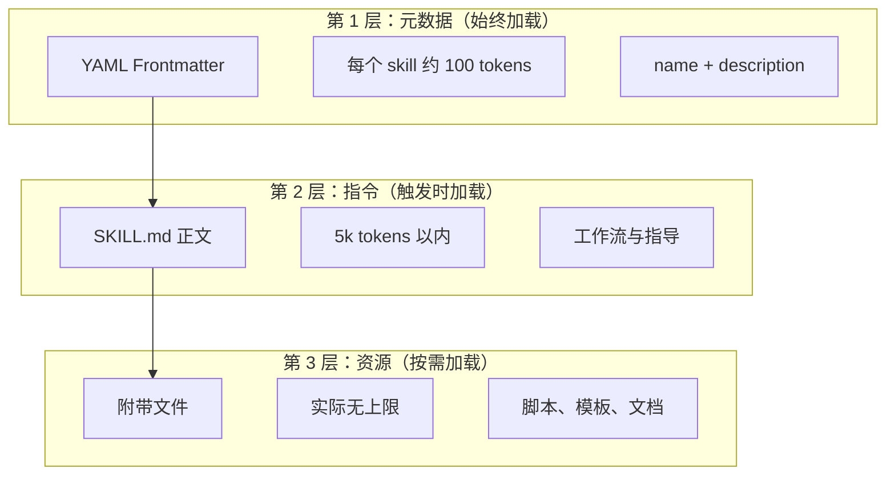
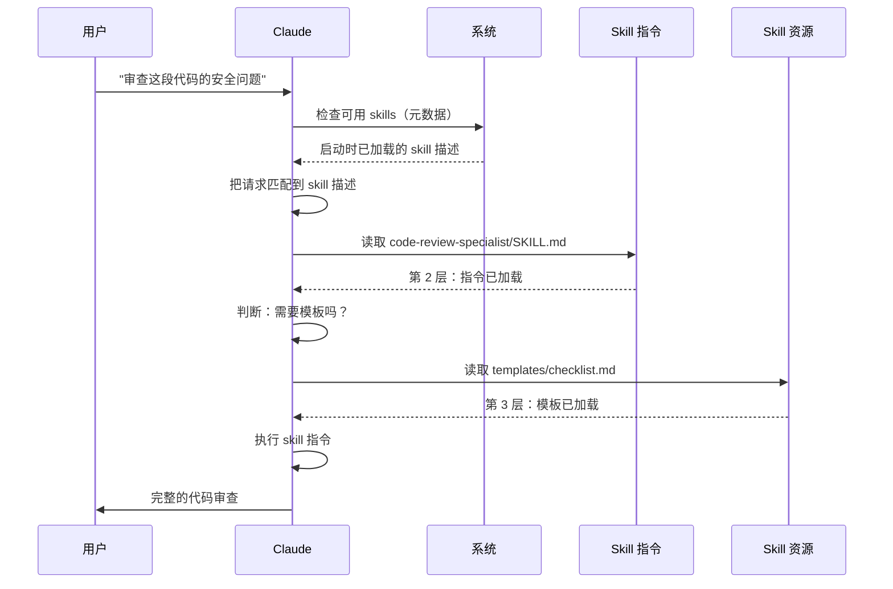

<picture>
  <source media="(prefers-color-scheme: dark)" srcset="../../resources/logos/claude-howto-logo-dark.svg">
  
</picture>

# Agent Skills 指南

Agent Skills 是可复用、基于文件系统的能力包，用来扩展 Claude 的功能。它们把领域知识、工作流程和最佳实践封装成可被发现的组件，Claude 会在相关场景下自动调用。

## 概览

**Agent Skills** 是模块化的能力，可以把通用 agent 转变为领域专家。和 prompt（针对一次性任务的会话级指令）不同，Skills 按需加载，省去了在多次对话中重复提供相同指导的麻烦。

### 主要好处

- **专门化 Claude**：针对特定领域任务定制能力
- **减少重复**：一次创建，多次对话自动复用
- **组合能力**：把多个 Skills 组合成复杂工作流
- **扩展工作流**：跨项目和团队复用
- **保证质量**：把最佳实践直接嵌入工作流

Skills 遵循 [Agent Skills](https://agentskills.io) 开放标准，可跨多个 AI 工具使用。Claude Code 在此基础上扩展了调用控制、subagent 执行和动态上下文注入等额外能力。

> **注意**：自定义 slash commands 已并入 skills。`.claude/commands/` 下的文件仍然有效，并支持相同的 frontmatter 字段。新开发建议直接使用 skills。当两者位于相同路径时（例如同时存在 `.claude/commands/review.md` 和 `.claude/skills/review/SKILL.md`），skill 优先。

## Skills 的工作方式：渐进式披露

Skills 采用**渐进式披露**（progressive disclosure）架构——Claude 按需分阶段加载信息，而不是一开始就塞满上下文。这样既能高效管理上下文，又不受数量上限约束。

### 三层加载



| 层级 | 加载时机 | Token 成本 | 内容 |
|------|----------|-----------|------|
| **第 1 层：元数据** | 始终（启动时） | 每个 Skill 约 100 tokens | YAML frontmatter 中的 `name` 和 `description` |
| **第 2 层：指令** | Skill 被触发时 | 5k tokens 以内 | SKILL.md 正文，包含指令和指导 |
| **第 3 层及以上：资源** | 按需 | 实际无上限 | 通过 bash 执行的附带文件，内容不进入上下文 |

这意味着你可以安装大量 Skills 而不用担心上下文损耗——在实际触发前，Claude 对每个 Skill 只知道它存在以及何时使用。

## Skill 加载流程



## Skill 类型与位置

| 类型 | 位置 | 作用范围 | 是否共享 | 适用场景 |
|------|------|---------|---------|---------|
| **企业级（Enterprise）** | Managed settings | 全组织用户 | 是 | 组织级统一标准 |
| **个人（Personal）** | `~/.claude/skills/<skill-name>/SKILL.md` | 个人 | 否 | 个人工作流 |
| **项目（Project）** | `.claude/skills/<skill-name>/SKILL.md` | 团队 | 是（通过 git） | 团队标准 |
| **插件（Plugin）** | `<plugin>/skills/<skill-name>/SKILL.md` | 启用范围内 | 视情况而定 | 随插件打包 |

当不同层级的 skill 同名时，高优先级位置胜出：**enterprise > personal > project**。插件 skill 使用 `plugin-name:skill-name` 命名空间，因此不会冲突。

> **Subagent skill 发现（v2.1.133+）**：subagent 现在通过 Skill tool 发现项目、用户和插件 skill，方式和主会话一致。早期版本限制 subagent 只能用自己的内嵌集合，导致 skill + subagent 组合工作流会静默降级；从 v2.1.133 起，同一份 skill 目录对两边都可见。

### 自动发现

**嵌套目录**：当你在子目录里操作文件时，Claude Code 会自动发现嵌套 `.claude/skills/` 目录中的 skill。例如编辑 `packages/frontend/` 下的文件时，Claude Code 也会查找 `packages/frontend/.claude/skills/`。这支持 monorepo 中各 package 拥有自己 skill 的场景。

**`--add-dir` 目录**：通过 `--add-dir` 添加的目录中的 skill 会自动加载，并支持实时变更检测。对这些目录中 skill 文件的任何修改都会立即生效，无需重启 Claude Code。

**重新加载 skill**：`/reload-skills` 命令（v2.1.152 新增）可以重新扫描所有 skill 目录而无需重启会话——适合在添加或编辑了一个未被实时检测拾取的 skill 后使用。`SessionStart` hook 也可以通过返回 `reloadSkills: true` 触发同样的重新扫描（见 [Hooks](../06-hooks/README.md)）。

**描述预算**：Skill 描述（第 1 层元数据）上限为**上下文窗口的 1%**（回退值：**8,000 字符**）。安装了大量 skill 时，描述可能会被截断。所有 skill 名称始终保留，但描述会被裁剪以适配。建议把关键用例写在描述前面。可用 `SLASH_COMMAND_TOOL_CHAR_BUDGET` 环境变量覆盖预算。

## 创建自定义 Skills

### 基本目录结构

```
my-skill/
├── SKILL.md           # 主指令（必需）
├── template.md        # 供 Claude 填写的模板
├── examples/
│   └── sample.md      # 展示预期格式的示例输出
└── scripts/
    └── validate.sh    # Claude 可执行的脚本
```

### SKILL.md 格式

```yaml
---
name: your-skill-name
description: 简要说明这个 Skill 做什么以及何时使用
---

# Your Skill Name

## Instructions
为 Claude 提供清晰的、分步骤的指导。

## Examples
展示使用这个 Skill 的具体示例。
```

### 必填字段

- **name**：仅小写字母、数字、连字符（最多 64 个字符）。不能包含 "anthropic" 或 "claude"。
- **description**：说明这个 Skill 做什么**以及**何时使用（最多 1024 个字符）。这非常关键，决定 Claude 是否能正确激活这个 skill。

### 可选 frontmatter 字段

```yaml
---
name: my-skill
description: 这个 skill 做什么以及何时使用
argument-hint: "[filename] [format]"        # 自动补全的提示
disable-model-invocation: true              # 只允许用户调用
user-invocable: false                       # 从 slash 菜单隐藏
allowed-tools: Read, Grep, Glob             # 限制工具访问
disallowed-tools: Write, Edit               # 激活时移除特定工具（v2.1.152）
model: opus                                 # 指定使用的模型
effort: high                                # effort 级别覆盖（low, medium, high, xhigh, max）
context: fork                               # 在隔离的 subagent 中运行
agent: Explore                              # 使用哪种 agent 类型（配合 context: fork）
shell: bash                                 # 命令所用 shell：bash（默认）或 powershell
hooks:                                      # skill 作用域内的 hooks
  PreToolUse:
    - matcher: "Bash"
      hooks:
        - type: command
          command: "./scripts/validate.sh"
paths: "src/api/**/*.ts"               # 限制 skill 激活时机的 glob 模式
---
```

| 字段 | 说明 |
|------|------|
| `name` | 仅小写字母、数字、连字符（最多 64 个字符）。不能包含 "anthropic" 或 "claude"。 |
| `description` | 这个 Skill 做什么**以及**何时使用（最多 1024 个字符）。对自动调用匹配至关重要。 |
| `argument-hint` | 在 `/` 自动补全菜单中显示的提示（例如 `"[filename] [format]"`）。 |
| `disable-model-invocation` | `true` = 只有用户能通过 `/name` 调用。Claude 永不自动调用。 |
| `user-invocable` | `false` = 从 `/` 菜单隐藏。只有 Claude 能自动调用。 |
| `allowed-tools` | 逗号分隔的工具列表，使用这些工具时无需权限提示。 |
| `disallowed-tools` | 逗号分隔的工具列表，skill 激活期间移除这些工具（与 `allowed-tools` 互补）。v2.1.152 新增。 |
| `model` | skill 激活期间的模型覆盖（例如 `opus`、`sonnet`）。 |
| `effort` | skill 激活期间的 effort 级别覆盖：`low`、`medium`、`high`、`xhigh` 或 `max`。可用级别取决于模型——Opus 4.8 默认是 `high`（Opus 4.7 为 `xhigh`）。 |
| `context` | `fork` 表示在 fork 出的 subagent 上下文中运行该 skill，拥有独立上下文窗口。 |
| `agent` | `context: fork` 时使用的 subagent 类型（例如 `Explore`、`Plan`、`general-purpose`）。 |
| `shell` | 用于 `` !`command` `` 替换和脚本的 shell：`bash`（默认）或 `powershell`。 |
| `hooks` | 限定在这个 skill 生命周期内的 hooks（格式与全局 hooks 相同）。 |
| `paths` | 限制 skill 自动激活时机的 glob 模式。逗号分隔的字符串或 YAML 列表。格式与路径相关规则相同。 |

## Skill 内容类型

Skills 可以包含两类内容，分别适合不同用途：

### 参考型内容

为 Claude 在当前任务中提供可应用的知识——约定、模式、风格指南、领域知识。在对话上下文中内联运行。

```yaml
---
name: api-conventions
description: 本代码库的 API 设计模式
---

When writing API endpoints:
- Use RESTful naming conventions
- Return consistent error formats
- Include request validation
```

### 任务型内容

针对具体动作的分步指令。通常直接用 `/skill-name` 调用。

```yaml
---
name: deploy
description: Deploy the application to production
context: fork
disable-model-invocation: true
---

Deploy the application:
1. Run the test suite
2. Build the application
3. Push to the deployment target
```

## 控制 Skill 调用

默认情况下，你和 Claude 都能调用任何 skill。两个 frontmatter 字段控制三种调用模式：

| Frontmatter | 你能调用 | Claude 能调用 |
|---|---|---|
| （默认） | 是 | 是 |
| `disable-model-invocation: true` | 是 | 否 |
| `user-invocable: false` | 否 | 是 |

**用 `disable-model-invocation: true`** 处理带副作用的工作流：`/commit`、`/deploy`、`/send-slack-message`。你不会希望 Claude 因为代码看起来就绪就擅自部署。

**用 `user-invocable: false`** 处理不可作为命令执行的背景知识。比如 `legacy-system-context` skill 解释一个旧系统如何工作——对 Claude 有用，但对用户而言不是一个有意义的动作。

## 字符串替换

Skills 支持动态值，这些值在 skill 内容发送给 Claude 之前被解析：

| 变量 | 说明 |
|------|------|
| `$ARGUMENTS` | 调用 skill 时传入的全部参数 |
| `$ARGUMENTS[N]` 或 `$N` | 按索引（从 0 开始）访问特定参数 |
| `${CLAUDE_SESSION_ID}` | 当前会话 ID |
| `${CLAUDE_SKILL_DIR}` | 包含该 skill SKILL.md 文件的目录 |
| `${CLAUDE_EFFORT}` | 当前 effort 级别（`low`、`medium`、`high`、`xhigh` 或 `max`）。可用于分支化 skill 行为，例如：`[ "${CLAUDE_EFFORT}" = "max" ] && deep_analysis`（v2.1.120+） |
| `` !`command` `` | 动态上下文注入——执行 shell 命令并把输出内联进来 |

**示例：**

```yaml
---
name: fix-issue
description: Fix a GitHub issue
---

Fix GitHub issue $ARGUMENTS following our coding standards.
1. Read the issue description
2. Implement the fix
3. Write tests
4. Create a commit
```

运行 `/fix-issue 123` 时，`$ARGUMENTS` 会被替换成 `123`。

## 注入动态上下文

`` !`command` `` 语法在 skill 内容发给 Claude 之前执行 shell 命令：

```yaml
---
name: pr-summary
description: Summarize changes in a pull request
context: fork
agent: Explore
---

## Pull request context
- PR diff: !`gh pr diff`
- PR comments: !`gh pr view --comments`
- Changed files: !`gh pr diff --name-only`

## Your task
Summarize this pull request...
```

命令立即执行；Claude 只看到最终输出。默认在 `bash` 中执行。在 frontmatter 设置 `shell: powershell` 改用 PowerShell。

## 在 subagent 中运行 Skills

添加 `context: fork` 可以在隔离的 subagent 上下文中运行 skill。该 skill 的内容会成为专用 subagent 的任务，拥有独立的上下文窗口，从而保持主对话干净。

> **v2.1.145 修复**：使用 `context: fork` 的 skill 在少数情况下可能触发无限递归调用循环。如果你编写或依赖 fork 类 skill，请升级到 v2.1.145+。

`agent` 字段指定使用哪种 agent 类型：

| Agent 类型 | 适用场景 |
|---|---|
| `Explore` | 只读研究、代码库分析 |
| `Plan` | 制定实现计划 |
| `general-purpose` | 需要全部工具的宽泛任务 |
| 自定义 agents | 在你的配置中定义的专用 agent |

**示例 frontmatter：**

```yaml
---
context: fork
agent: Explore
---
```

**完整 skill 示例：**

```yaml
---
name: deep-research
description: Research a topic thoroughly
context: fork
agent: Explore
---

Research $ARGUMENTS thoroughly:
1. Find relevant files using Glob and Grep
2. Read and analyze the code
3. Summarize findings with specific file references
```

## 实战示例

### 示例 1：代码审查 Skill

**目录结构：**

```
~/.claude/skills/code-review-specialist/
├── SKILL.md
├── templates/
│   ├── review-checklist.md
│   └── finding-template.md
└── scripts/
    ├── analyze-metrics.py
    └── compare-complexity.py
```

**文件：** `~/.claude/skills/code-review-specialist/SKILL.md`

```yaml
---
name: code-review-specialist
description: Comprehensive code review with security, performance, and quality analysis. Use when users ask to review code, analyze code quality, evaluate pull requests, or mention code review, security analysis, or performance optimization.
---

# Code Review Skill

This skill provides comprehensive code review capabilities focusing on:

1. **Security Analysis**
   - Authentication/authorization issues
   - Data exposure risks
   - Injection vulnerabilities
   - Cryptographic weaknesses

2. **Performance Review**
   - Algorithm efficiency (Big O analysis)
   - Memory optimization
   - Database query optimization
   - Caching opportunities

3. **Code Quality**
   - SOLID principles
   - Design patterns
   - Naming conventions
   - Test coverage

4. **Maintainability**
   - Code readability
   - Function size (should be < 50 lines)
   - Cyclomatic complexity
   - Type safety

## Review Template

For each piece of code reviewed, provide:

### Summary
- Overall quality assessment (1-5)
- Key findings count
- Recommended priority areas

### Critical Issues (if any)
- **Issue**: Clear description
- **Location**: File and line number
- **Impact**: Why this matters
- **Severity**: Critical/High/Medium
- **Fix**: Code example

For detailed checklists, see [templates/review-checklist.md](templates/review-checklist.md).
```

### 示例 2：代码库可视化 Skill

这个 skill 生成可交互的 HTML 可视化：

**目录结构：**

```
~/.claude/skills/codebase-visualizer/
├── SKILL.md
└── scripts/
    └── visualize.py
```

**文件：** `~/.claude/skills/codebase-visualizer/SKILL.md`

````yaml
---
name: codebase-visualizer
description: Generate an interactive collapsible tree visualization of your codebase. Use when exploring a new repo, understanding project structure, or identifying large files.
allowed-tools: Bash(python *)
---

# Codebase Visualizer

Generate an interactive HTML tree view showing your project's file structure.

## Usage

Run the visualization script from your project root:

```bash
python ~/.claude/skills/codebase-visualizer/scripts/visualize.py .
```

This creates `codebase-map.html` and opens it in your default browser.

## What the visualization shows

- **Collapsible directories**: Click folders to expand/collapse
- **File sizes**: Displayed next to each file
- **Colors**: Different colors for different file types
- **Directory totals**: Shows aggregate size of each folder
````

附带的 Python 脚本负责繁重工作，Claude 负责编排。

### 示例 3：部署 Skill（仅用户调用）

```yaml
---
name: deploy
description: Deploy the application to production
disable-model-invocation: true
allowed-tools: Bash(npm *), Bash(git *)
---

Deploy $ARGUMENTS to production:

1. Run the test suite: `npm test`
2. Build the application: `npm run build`
3. Push to the deployment target
4. Verify the deployment succeeded
5. Report deployment status
```

### 示例 4：品牌语气 Skill（背景知识）

```yaml
---
name: brand-voice
description: Ensure all communication matches brand voice and tone guidelines. Use when creating marketing copy, customer communications, or public-facing content.
user-invocable: false
---

## Tone of Voice
- **Friendly but professional** - approachable without being casual
- **Clear and concise** - avoid jargon
- **Confident** - we know what we're doing
- **Empathetic** - understand user needs

## Writing Guidelines
- Use "you" when addressing readers
- Use active voice
- Keep sentences under 20 words
- Start with value proposition

For templates, see [templates/](templates/).
```

### 示例 5：CLAUDE.md 生成 Skill

```yaml
---
name: claude-md
description: Create or update CLAUDE.md files following best practices for optimal AI agent onboarding. Use when users mention CLAUDE.md, project documentation, or AI onboarding.
---

## Core Principles

**LLMs are stateless**: CLAUDE.md is the only file automatically included in every conversation.

### The Golden Rules

1. **Less is More**: Keep under 300 lines (ideally under 100)
2. **Universal Applicability**: Only include information relevant to EVERY session
3. **Don't Use Claude as a Linter**: Use deterministic tools instead
4. **Never Auto-Generate**: Craft it manually with careful consideration

## Essential Sections

- **Project Name**: Brief one-line description
- **Tech Stack**: Primary language, frameworks, database
- **Development Commands**: Install, test, build commands
- **Critical Conventions**: Only non-obvious, high-impact conventions
- **Known Issues / Gotchas**: Things that trip up developers
```

### 示例 6：带脚本的重构 Skill

**目录结构：**

```
refactor/
├── SKILL.md
├── references/
│   ├── code-smells.md
│   └── refactoring-catalog.md
├── templates/
│   └── refactoring-plan.md
└── scripts/
    ├── analyze-complexity.py
    └── detect-smells.py
```

**文件：** `refactor/SKILL.md`

```yaml
---
name: code-refactor
description: Systematic code refactoring based on Martin Fowler's methodology. Use when users ask to refactor code, improve code structure, reduce technical debt, or eliminate code smells.
---

# Code Refactoring Skill

A phased approach emphasizing safe, incremental changes backed by tests.

## Workflow

Phase 1: Research & Analysis → Phase 2: Test Coverage Assessment →
Phase 3: Code Smell Identification → Phase 4: Refactoring Plan Creation →
Phase 5: Incremental Implementation → Phase 6: Review & Iteration

## Core Principles

1. **Behavior Preservation**: External behavior must remain unchanged
2. **Small Steps**: Make tiny, testable changes
3. **Test-Driven**: Tests are the safety net
4. **Continuous**: Refactoring is ongoing, not a one-time event

For code smell catalog, see [references/code-smells.md](references/code-smells.md).
For refactoring techniques, see [references/refactoring-catalog.md](references/refactoring-catalog.md).
```

## 支持文件

Skills 的目录里除了 `SKILL.md` 还可以放多个文件。这些支持文件（模板、示例、脚本、参考文档）让你能保持主文件聚焦，同时为 Claude 提供按需加载的额外资源。

```
my-skill/
├── SKILL.md              # 主指令（必需，保持在 500 行以内）
├── templates/            # 供 Claude 填写的模板
│   └── output-format.md
├── examples/             # 展示预期格式的示例输出
│   └── sample-output.md
├── references/           # 领域知识和规范
│   └── api-spec.md
└── scripts/              # Claude 可执行的脚本
    └── validate.sh
```

支持文件的使用准则：

- `SKILL.md` 保持在 **500 行以内**。把详细参考资料、大型示例和规范移到单独文件。
- 在 `SKILL.md` 中用**相对路径**引用其他文件（例如 `[API reference](references/api-spec.md)`）。
- 支持文件在第 3 层按需加载，因此在 Claude 真正读取前不占用上下文。

## 管理 Skills

### 查看可用 Skills

直接问 Claude：
```
What Skills are available?
```

或检查文件系统：
```bash
# 列出个人 Skills
ls ~/.claude/skills/

# 列出项目 Skills
ls .claude/skills/
```

> **提示（v2.1.121+）**：在 `/skills` 交互菜单里输入即可筛选——安装了多个 skill 时很有用。

### 测试 Skill

两种测试方式：

**让 Claude 自动调用**——问一个匹配 description 的问题：
```
Can you help me review this code for security issues?
```

**或直接用 skill 名称调用**：
```
/code-review-specialist src/auth/login.ts
```

> **注意**：这个本地 skill 安装为 `code-review-specialist`，因此**不会**和内置 `/code-review` 命令冲突（即 Claude Code v2.1.146 中由 `/simplify` 改名而来的命令）。如果你把它复制到 `~/.claude/skills/code-review/`，就会覆盖内置命令——保留 `-specialist` 后缀以避免冲突。

### 更新 Skill

直接编辑 `SKILL.md` 文件。改动在下次启动 Claude Code 时生效。

```bash
# 个人 Skill
code ~/.claude/skills/my-skill/SKILL.md

# 项目 Skill
code .claude/skills/my-skill/SKILL.md
```

### 限制 Claude 对 Skill 的访问

三种方式控制 Claude 能调用哪些 skill：

**在 `/permissions` 中禁用所有 skills**：
```
# 加入 deny 规则：
Skill
```

**允许或拒绝特定 skill**：
```
# 只允许特定 skills
Skill(commit)
Skill(review-pr *)

# 拒绝特定 skills
Skill(deploy *)
```

**逐个隐藏 skill**——在其 frontmatter 添加 `disable-model-invocation: true`。

### 控制 Skill 覆盖行为（`skillOverrides`）

当项目 skill 和用户 skill 同名时，默认项目胜出。`skillOverrides` 设置（v2.1.129+）让你可以调整这一点。添加到 `~/.claude/settings.json` 或项目 `.claude/settings.json`：

```json
{
  "skillOverrides": "name-only"
}
```

可接受的取值：

| 取值 | 行为 |
|------|------|
| `"on"`（默认） | 仓库 skill 可以覆盖同名用户 skill。 |
| `"off"` | 完全禁用覆盖——用户 skill 始终胜出。 |
| `"name-only"` | 仅按 skill 名称匹配覆盖（忽略 description / 来源）。 |
| `"user-invocable-only"` | 只有 user-invocable 的 skill 可被覆盖——model 调用的 skill 始终来自原始位置。 |

适用于团队策略声明"用户自定义 skill 必须始终优先"（`"off"`）或"只允许基于名称的窄覆盖"（`"name-only"`）。

## 最佳实践

### 1. 描述要具体

- **差（模糊）**："Helps with documents"
- **好（具体）**："Extract text and tables from PDF files, fill forms, merge documents. Use when working with PDF files or when the user mentions PDFs, forms, or document extraction."

### 2. 保持 Skill 聚焦

- 一个 Skill = 一种能力
- ✅ "PDF form filling"
- ❌ "Document processing"（太宽泛）

### 3. 包含触发词

在描述中加入匹配用户请求的关键词：
```yaml
description: Analyze Excel spreadsheets, generate pivot tables, create charts. Use when working with Excel files, spreadsheets, or .xlsx files.
```

### 4. SKILL.md 保持在 500 行以内

把详细参考资料移到单独文件，Claude 按需加载。

### 5. 引用支持文件

```markdown
## Additional resources

- For complete API details, see [reference.md](reference.md)
- For usage examples, see [examples.md](examples.md)
```

### 该做

- 用清晰、有描述性的名称
- 提供完整的指令
- 加入具体示例
- 打包相关脚本和模板
- 用真实场景测试
- 记录依赖

### 不该做

- 不要为一次性任务创建 skill
- 不要重复已有功能
- 不要把 skill 做得太宽泛
- 不要省略 description 字段
- 不要在未审计的情况下安装来自不可信来源的 skill

## 故障排查

### 快速参考

| 问题 | 解决方案 |
|------|---------|
| Claude 不使用 Skill | 在 description 中加入更具体的触发词 |
| 找不到 Skill 文件 | 核对路径：`~/.claude/skills/name/SKILL.md` |
| YAML 错误 | 检查 `---` 标记、缩进、不要用 tab |
| Skills 冲突 | 在描述中使用有区分度的触发词 |
| 脚本不运行 | 检查权限：`chmod +x scripts/*.py` |
| Claude 看不到全部 skills | skill 太多；查看 `/context` 中的警告 |

### Skill 没有触发

如果 Claude 没有按预期使用你的 skill：

1. 检查 description 是否包含用户自然会说出的关键词
2. 确认问 "What skills are available?" 时该 skill 会列出
3. 尝试改写请求以匹配 description
4. 用 `/skill-name` 直接调用测试

### Skill 触发太频繁

如果 Claude 在你不希望的时候使用你的 skill：

1. 让 description 更具体
2. 为仅手动调用添加 `disable-model-invocation: true`

### Claude 看不到全部 Skills

Skill 描述按**上下文窗口的 1%**加载（回退值：**8,000 字符**）。每条上限 250 字符，与预算无关。运行 `/context` 查看被排除 skill 的警告。用 `SLASH_COMMAND_TOOL_CHAR_BUDGET` 环境变量覆盖预算。

## 安全注意事项

**只使用来自可信来源的 Skills。** Skills 通过指令和代码赋予 Claude 能力——恶意 Skill 可以引导 Claude 以有害方式调用工具或执行代码。

**关键安全考量：**

- **彻底审计**：审查 Skill 目录中的所有文件
- **外部来源有风险**：从外部 URL 获取内容的 skill 可能被入侵
- **工具滥用**：恶意 skill 可以以有害方式调用工具
- **当作安装软件对待**：只使用来自可信来源的 skill

### 禁用 skill 中的 shell 替换

Skills 支持 `` !`command` `` 语法，在 Claude 看到之前把 shell 命令输出注入 prompt。在安全敏感环境（共享企业部署、锁定的 CI runner）中，可以通过 `disableSkillShellExecution` 设置（**v2.1.91** 新增）完全禁用这种替换：

```jsonc
// ~/.claude/settings.json 或 managed policy
{
  "disableSkillShellExecution": true
}
```

`disableSkillShellExecution` 为 `true` 时，skill 中的任何 `` !`command` `` 标记都会作为字面文本保留而非执行——在不禁用 skills 本身的前提下移除 skill 级别的 shell 注入攻击面。考虑配合 `allowedTools` 白名单实现纵深防御。

### 隐藏内置 skills（`disableBundledSkills`）

`disableBundledSkills` 设置（**v2.1.169** 新增）对模型隐藏 Claude Code 自带的内置 skills、workflows 和 commands。当内置 skills 在某个项目里是噪音，或想缩小模型的 skill 范围时使用：

```jsonc
// ~/.claude/settings.json 或项目 .claude/settings.json
{
  "disableBundledSkills": true
}
```

等价的环境变量形式：

```bash
export CLAUDE_CODE_DISABLE_BUNDLED_SKILLS=1
```

## Skills vs 其他功能

| 功能 | 调用方式 | 适用场景 |
|---------|------------|----------|
| **Skills** | 自动或 `/name` | 可复用专业知识、工作流 |
| **Slash Commands** | 用户发起 `/name` | 快捷操作（已并入 skills） |
| **Subagents** | 自动委派 | 隔离的任务执行 |
| **Memory（CLAUDE.md）** | 始终加载 | 持久的项目上下文 |
| **MCP** | 实时 | 外部数据/服务访问 |
| **Hooks** | 事件驱动 | 自动化副作用 |

## 内置 Skills

Claude Code 自带九个内置 skill，无需安装即可使用：

| Skill | 描述 |
|-------|-------------|
| `/batch <instruction>` | 使用 git worktree 在代码库中编排大规模并行修改 |
| `/claude-api` | 加载 Claude API/SDK 参考；在 `anthropic`/`@anthropic-ai/sdk` 导入时自动激活 |
| `/debug [description]` | 读取调试日志排查当前会话问题 |
| `/fewer-permission-prompts` | 扫描会话记录，为常见只读工具提出优先级化的白名单 |
| `/loop [interval] <prompt>` | 按间隔重复运行 prompt（例如 `/loop 5m check the deploy`） |
| `/run` *(v2.1.145+)* | 启动本项目应用以查看改动效果——先查找项目 skill，否则按项目类型回退到内置模式 |
| `/run-skill-generator` *(v2.1.145+)* | 通过生成针对项目的 skill，教 `/run`/`/verify` 如何处理特定项目 |
| `/code-review [effort]` | 在指定 effort 级别审查当前 diff 的正确性 bug（例如 `/code-review high`）；传 `--comment` 把发现作为行内 PR 评论发布。v2.1.146 中由 `/simplify` 改名而来 |
| `/verify` *(v2.1.145+)* | 构建、运行并观察应用，确认修复有效（不只是测试通过） |

这些 skill 开箱即用，无需安装或配置。它们遵循和自定义 skill 相同的 SKILL.md 格式。

## 共享 Skills

### 项目 Skills（团队共享）

1. 在 `.claude/skills/` 中创建 Skill
2. 提交到 git
3. 团队成员拉取改动——Skills 立即可用

### 个人 Skills

```bash
# 复制到个人目录
cp -r my-skill ~/.claude/skills/

# 让脚本可执行
chmod +x ~/.claude/skills/my-skill/scripts/*.py
```

### 插件分发

把 skills 打包进插件的 `skills/` 目录以获得更广分发。

## 继续深入：一个 Skill 集合和一个 Skill 管理器

当你开始认真构建 skills 时，两样东西变得必不可少：一套经过验证的 skill 库，以及一个管理它们的工具。

**[luongnv89/skills](https://github.com/luongnv89/skills)** — 我在几乎所有项目中日常使用的一套 skills 集合。亮点包括 `logo-designer`（即时生成项目 logo）和 `ollama-optimizer`（针对你的硬件调优本地 LLM 性能）。如果你想要开箱即用的 skill，这是很好的起点。

**[luongnv89/asm](https://github.com/luongnv89/asm)** — Agent Skill Manager。处理 skill 开发、重复检测和测试。`asm link` 命令让你无需到处复制文件就能在任何项目中测试 skill——一旦 skill 超过几个，这就成了必需品。

## 更多资源

- [官方 Skills 文档](https://code.claude.com/docs/en/skills)
- [Agent Skills 架构博客](https://claude.com/blog/equipping-agents-for-the-real-world-with-agent-skills)
- [Skills 仓库](https://github.com/luongnv89/skills) - 一套开箱即用的 skills
- [Slash Commands 指南](../01-slash-commands/) - 用户发起的快捷命令
- [Subagents 指南](../04-subagents/) - 委派的 AI agent
- [Memory 指南](../02-memory/) - 持久上下文
- [MCP（Model Context Protocol）](../05-mcp/) - 实时外部数据
- [Hooks 指南](../06-hooks/) - 事件驱动的自动化

---
**最后更新**：2026 年 6 月 10 日
**Claude Code 版本**：2.1.170
**来源**：
- https://code.claude.com/docs/en/skills
- https://code.claude.com/docs/en/settings
- https://code.claude.com/docs/en/changelog
- https://code.claude.com/docs/en/commands
- https://github.com/anthropics/claude-code/releases/tag/v2.1.152
- https://github.com/anthropics/claude-code/releases/tag/v2.1.154
**兼容模型**：Claude Sonnet 4.6、Claude Opus 4.8、Claude Haiku 4.5
