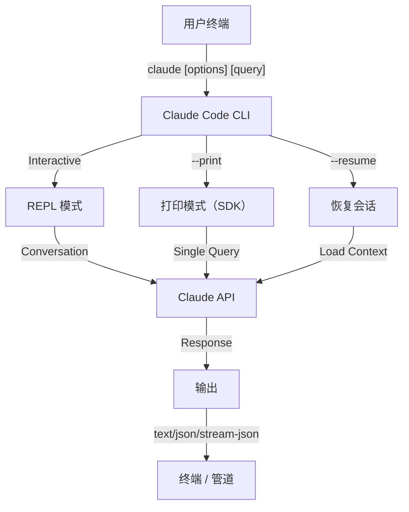
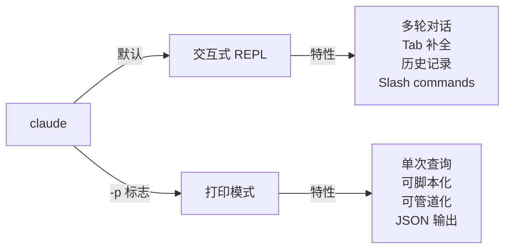

<picture>
  <source media="(prefers-color-scheme: dark)" srcset="../../resources/logos/claude-howto-logo-dark.svg">
  
</picture>

# CLI 参考

## 概览

Claude Code CLI（命令行接口）是与 Claude Code 交互的主要方式。它提供了强大的选项，用于执行查询、管理会话、配置模型，以及将 Claude 集成到你的开发工作流中。

## 架构



## 运行时与打包

自 **v2.1.113** 起，Claude Code CLI 通过可选的 npm 依赖启动**原生平台二进制文件**（macOS、Linux、Windows）。二进制文件会在安装时匹配你的操作系统和架构——旧的打包 JavaScript 运行时在 macOS 或 Linux 上已不再是默认方案。

**面向用户的安装方式不变**：`npm install -g @anthropic-ai/claude-code` 仍然可用，且依然是推荐方式。npm 会在后台为你的平台拉取正确的原生二进制文件。

**下载地址**（v2.1.116+）：原生二进制文件由 `https://downloads.claude.ai/claude-code-releases` 提供。

> **企业 / 代理用户**：如果你的网络需要显式白名单，请将 `downloads.claude.ai`（以及 `https://downloads.claude.ai/claude-code-releases`）添加到代理出口规则中。之前只将 `storage.googleapis.com` 或 npm registry 加入白名单的环境需要更新，否则 `claude update` 和首次安装将会失败。

旧的 JavaScript 打包版本仍会为 Windows 以及锁定使用该版本的环境保留；这些安装继续将 Glob 和 Grep 作为一等工具提供（参见[工具与权限管理](#工具与权限管理)下的 Glob/Grep 脚注）。

## CLI 命令

| 命令 | 说明 | 示例 |
|---------|-------------|---------|
| `claude` | 启动交互式 REPL | `claude` |
| `claude "query"` | 带初始提示启动 REPL | `claude "explain this project"` |
| `claude -p "query"` | 打印模式 — 查询后退出 | `claude -p "explain this function"` |
| `cat file \| claude -p "query"` | 处理管道传入的内容 | `cat logs.txt \| claude -p "explain"` |
| `claude -c` | 继续最近一次会话 | `claude -c` |
| `claude -c -p "query"` | 在打印模式下继续 | `claude -c -p "check for type errors"` |
| `claude -r "<session>" "query"` | 按 ID 或名称恢复会话 | `claude -r "auth-refactor" "finish this PR"` |
| `claude update` | 更新到最新版本 | `claude update` |
| `/doctor`（slash command） | 诊断安装、配置和插件健康状况。自 v2.1.116 起，可在 **Claude 响应期间**打开，内联显示状态图标，支持按 `f` 键自动修复检测到的问题 | 在 REPL 中运行 `/doctor` |
| `claude mcp` | 配置 MCP servers | 见 [MCP 文档](../05-mcp/) |
| `claude mcp serve` | 将 Claude Code 作为 MCP server 运行 | `claude mcp serve` |
| `claude agents` | 打开 **Agent View**（Research Preview，v2.1.139+）— 多会话管理器，列出所有 Claude Code 会话及其状态。详见下方 [Agent View](#agent-view-claude-agents-v21139) | `claude agents` |
| `claude auto-mode defaults` | 以 JSON 格式打印 auto mode 默认规则 | `claude auto-mode defaults` |
| `claude remote-control` | 启动 Remote Control 服务 | `claude remote-control` |
| `claude plugin` | 管理插件（安装、启用、禁用） | `claude plugin install my-plugin` |
| `claude plugin tag <version>` | 为插件创建发布 git tag 并进行版本校验（v2.1.118+） | `claude plugin tag v0.3.0` |
| `claude install [version]` | 安装指定的原生二进制版本。接受 `stable`、`latest` 或显式版本号 | `claude install 2.1.131` |
| `claude project purge [path]` | 删除项目中所有 Claude Code 本地状态（记录、任务、调试日志、文件编辑历史、提示历史和 `~/.claude.json` 条目）。省略 `[path]` 则打开交互式选择器。参数：`--dry-run` 预览、`-y/--yes` 跳过确认、`-i/--interactive` 逐项确认、`--all` 处理所有项目（v2.1.126+） | `claude project purge ~/work/repo --dry-run` |
| `claude plugin prune` | 移除孤立的自动安装插件依赖（父插件已移除）。`plugin uninstall --prune` 在卸载目标插件后执行相同的级联清理（v2.1.121+） | `claude plugin prune` |
| `claude ultrareview [target]` | 以非交互方式运行 `/ultrareview`。将结果打印到 stdout，成功时退出码 0 / 有问题时退出码 1。使用 `--json` 输出原始结果，`--timeout <minutes>` 覆盖默认的 30 分钟超时（v2.1.120+） | `claude ultrareview 1234 --json` |
| `claude auth login` | 登录（支持 `--email`、`--sso`）。自 v2.1.126 起，当浏览器回调无法访问 localhost 时（WSL2、SSH、容器），支持将 OAuth code 粘贴到终端作为回退方案 | `claude auth login --email user@example.com` |
| `claude auth logout` | 注销当前账号 | `claude auth logout` |
| `claude auth status` | 检查登录状态（已登录退出码 0，未登录退出码 1） | `claude auth status` |

## 核心标志

| 标志 | 说明 | 示例 |
|------|-------------|---------|
| `-p, --print` | 输出结果但不进入交互模式 | `claude -p "query"` |
| `-c, --continue` | 加载最近一次会话 | `claude --continue` |
| `-r, --resume` | 按 ID 或名称恢复指定会话 | `claude --resume auth-refactor` |
| `-v, --version` | 输出版本号 | `claude -v` |
| `-w, --worktree` | 在隔离的 git worktree 中启动 | `claude -w` |
| `-n, --name` | 会话显示名称 | `claude -n "auth-refactor"` |
| `--from-pr <url-or-number>` | 恢复与 pull/merge request 关联的会话。自 v2.1.119 起支持 GitHub（cloud + Enterprise）、GitLab MR 和 Bitbucket PR URL；此前仅支持 GitHub.com | `claude --from-pr 42` 或 `claude --from-pr https://gitlab.example.com/org/repo/-/merge_requests/17` |
| `--remote "task"` | 在 claude.ai 上创建 web 会话 | `claude --remote "implement API"` |
| `--remote-control, --rc` | 使用 Remote Control 进入交互式会话 | `claude --rc` |
| `--teleport` | 将 web 会话恢复到本地 | `claude --teleport` |
| `--teammate-mode` | Agent team 显示模式 | `claude --teammate-mode tmux` |
| `--bare` | 极简模式（跳过 hooks、skills、plugins、MCP、auto memory、CLAUDE.md） | `claude --bare` |
| `--enable-auto-mode` | 解锁 auto permission mode（Max 订阅者在 Opus 4.7 上不再需要此标志） | `claude --enable-auto-mode` |
| `--channels` | 订阅 MCP channel 插件 | `claude --channels discord,telegram` |
| `--chrome` / `--no-chrome` | 启用 / 禁用 Chrome 浏览器集成 | `claude --chrome` |
| `--effort` | 设置推理强度 | `claude --effort high` |
| `--init` / `--init-only` | 运行初始化 hooks | `claude --init` |
| `--maintenance` | 运行维护 hooks 后退出 | `claude --maintenance` |
| `--disable-slash-commands` | 禁用所有 skills 和 slash commands | `claude --disable-slash-commands` |
| `--no-session-persistence` | 禁用会话保存（打印模式） | `claude -p --no-session-persistence "query"` |
| `--exclude-dynamic-system-prompt-sections` | 从系统提示中排除动态部分，以获得更好的 prompt cache 命中率 | `claude -p --exclude-dynamic-system-prompt-sections "query"` |

### 交互模式 vs 打印模式



**交互模式**（默认）：
```bash
# 启动交互式会话
claude

# 带初始提示启动
claude "explain the authentication flow"
```

**打印模式**（非交互式）：
```bash
# 单次查询后退出
claude -p "what does this function do?"

# 处理文件内容
cat error.log | claude -p "explain this error"

# 与其他工具串联
claude -p "list todos" | grep "URGENT"
```

## 模型与配置

| 标志 | 说明 | 示例 |
|------|-------------|---------|
| `--model` | 设置模型（sonnet、opus、haiku 或完整模型名） | `claude --model opus` |
| `--fallback-model` | 负载过高时自动切换的后备模型 | `claude -p --fallback-model sonnet "query"` |
| `--agent` | 为会话指定 agent | `claude --agent my-custom-agent` |
| `--agents` | 通过 JSON 定义自定义 subagents | 见 [Agents 配置](#agents-配置) |
| `--effort` | 设置推理级别（low、medium、high、xhigh、max） | `claude --effort xhigh` |

### 模型选择示例

```bash
# 复杂任务使用 Opus 4.7
claude --model opus "design a caching strategy"

# 快速任务使用 Haiku 4.5
claude --model haiku -p "format this JSON"

# 使用完整模型名
claude --model claude-sonnet-4-6-20250929 "review this code"

# 带后备模型以提升可靠性
claude -p --model opus --fallback-model sonnet "analyze architecture"

# 使用 opusplan（Opus 规划，Sonnet 执行）
claude --model opusplan "design and implement the caching layer"
```

> **网关模型发现（v2.1.129+，需主动启用）**：当 `ANTHROPIC_BASE_URL` 指向兼容 Anthropic 的网关时，设置 `CLAUDE_CODE_ENABLE_GATEWAY_MODEL_DISCOVERY=1` 可从网关的 `/v1/models` 端点填充 `/model`。未设置环境变量时，`/model` 使用内置静态列表。此标志为主动启用（v2.1.129 中修改），因为发现调用可能暴露用户无权使用的模型；v2.1.126 中该行为是隐式的，已回退。

## 系统提示词自定义

| 标志 | 说明 | 示例 |
|------|-------------|---------|
| `--system-prompt` | 替换整个默认提示词 | `claude --system-prompt "You are a Python expert"` |
| `--system-prompt-file` | 从文件加载提示词（仅打印模式） | `claude -p --system-prompt-file ./prompt.txt "query"` |
| `--append-system-prompt` | 追加到默认提示词 | `claude --append-system-prompt "Always use TypeScript"` |

### 系统提示词示例

```bash
# 完全自定义角色
claude --system-prompt "You are a senior security engineer. Focus on vulnerabilities."

# 追加特定指令
claude --append-system-prompt "Always include unit tests with code examples"

# 从文件加载复杂提示词
claude -p --system-prompt-file ./prompts/code-reviewer.txt "review main.py"
```

### 系统提示词标志对比

| 标志 | 行为 | 交互模式 | 打印模式 |
|------|----------|-------------|-------|
| `--system-prompt` | 替换整个默认系统提示词 | ✅ | ✅ |
| `--system-prompt-file` | 用文件中的提示词替换 | ❌ | ✅ |
| `--append-system-prompt` | 追加到默认系统提示词 | ✅ | ✅ |

**`--system-prompt-file` 仅在打印模式下使用。交互模式请使用 `--system-prompt` 或 `--append-system-prompt`。**

## 工具与权限管理

| 标志 | 说明 | 示例 |
|------|-------------|---------|
| `--tools` | 限制可用的内置工具 | `claude -p --tools "Bash,Edit,Read" "query"` |
| `--allowedTools` | 无需提示即可直接执行的工具 | `"Bash(git log:*)" "Read"` |
| `--disallowedTools` | 从上下文中移除的工具 | `"Bash(rm:*)" "Edit"` |
| `--dangerously-skip-permissions` | 跳过所有权限提示 | `claude --dangerously-skip-permissions` |
| `--permission-mode` | 以指定权限模式启动 | `claude --permission-mode auto` |
| `--permission-prompt-tool` | 用于权限处理的 MCP tool | `claude -p --permission-prompt-tool mcp_auth "query"` |
| `--enable-auto-mode` | 解锁 auto permission mode | `claude --enable-auto-mode` |

> **Glob / Grep 脚注（v2.1.113+）**：在原生 macOS/Linux 构建中，`Glob` 和 `Grep` 以嵌入的 `bfs` 和 `ugrep` 二进制文件通过 Bash 工具提供，而非作为独立的一等工具。Windows 和 npm 打包（JS）安装仍然将它们作为独立工具暴露。对于 subagent 的 `allowedTools` / `disallowedTools` 列表，后端替换是透明的——你可以在所有平台上继续使用 `Glob` / `Grep` 进行配置。

> **PowerShell 自动批准（v2.1.119）**：PowerShell 工具命令可以像 Bash 命令一样在权限模式下自动批准。使用与 `Bash(...)` 规则相同的匹配语法来限定 PowerShell 权限——例如 `PowerShell(Get-ChildItem:*)`。

> **`--permission-mode` 在恢复时生效（v2.1.132+）**：`claude -p --continue --permission-mode plan`（以及 `--resume`）现在会正确遵循该标志。早期版本在恢复会话时静默丢弃 `--permission-mode`，因此一个 plan-mode 会话在未重新传递该标志的情况下恢复时会被静默降级——此问题已修复。

### 权限示例

```bash
# 代码审查只读模式
claude --permission-mode plan "review this codebase"

# 仅允许安全工具
claude --tools "Read,Grep,Glob" -p "find all TODO comments"

# 允许特定 git 命令无需提示
claude --allowedTools "Bash(git status:*)" "Bash(git log:*)"

# 阻止危险操作
claude --disallowedTools "Bash(rm -rf:*)" "Bash(git push --force:*)"
```

## 输出与格式

| 标志 | 说明 | 选项 | 示例 |
|------|-------------|---------|---------|
| `--output-format` | 指定输出格式（打印模式） | `text`、`json`、`stream-json` | `claude -p --output-format json "query"` |
| `--input-format` | 指定输入格式（打印模式） | `text`、`stream-json` | `claude -p --input-format stream-json` |
| `--verbose` | 启用详细日志 | | `claude --verbose` |
| `--include-partial-messages` | 包含流式事件 | 需要 `stream-json` | `claude -p --output-format stream-json --include-partial-messages "query"` |
| `--json-schema` | 获取符合 schema 校验的 JSON 输出 | | `claude -p --json-schema '{"type":"object"}' "query"` |
| `--max-budget-usd` | 打印模式最大花费 | | `claude -p --max-budget-usd 5.00 "query"` |

### 输出格式示例

```bash
# 纯文本（默认）
claude -p "explain this code"

# 供程序使用的 JSON
claude -p --output-format json "list all functions in main.py"

# 实时处理的流式 JSON
claude -p --output-format stream-json "generate a long report"

# 带 schema 验证的结构化输出
claude -p --json-schema '{"type":"object","properties":{"bugs":{"type":"array"}}}' \
  "find bugs in this code and return as JSON"
```

## 工作区与目录

| 标志 | 说明 | 示例 |
|------|-------------|---------|
| `--add-dir` | 添加额外工作目录 | `claude --add-dir ../apps ../lib` |
| `--setting-sources` | 逗号分隔的设置来源 | `claude --setting-sources user,project` |

> **`/config` 持久化（v2.1.119）**：通过 `/config` 命令交互式做出的修改现在写入 `~/.claude/settings.json`，并遵循正常的优先级链（project → local → policy → user）。在 v2.1.119 之前，部分 `/config` 修改仅在会话内有效。完整优先级顺序见 [Memory & Settings](../02-memory/README.md)。
| `--settings` | 从文件或 JSON 加载设置 | `claude --settings ./settings.json` |
| `--plugin-dir` | 从目录加载插件（可重复使用） | `claude --plugin-dir ./my-plugin` |

### 多目录示例

```bash
# 跨多个项目目录工作
claude --add-dir ../frontend ../backend ../shared "find all API endpoints"

# 加载自定义设置
claude --settings '{"model":"opus","verbose":true}' "complex task"
```

## MCP 配置

| 标志 | 说明 | 示例 |
|------|-------------|---------|
| `--mcp-config` | 从 JSON 文件加载 MCP servers | `claude --mcp-config ./mcp.json` |
| `--strict-mcp-config` | 仅使用指定的 MCP 配置 | `claude --strict-mcp-config --mcp-config ./mcp.json` |
| `--channels` | 订阅 MCP channel 插件 | `claude --channels discord,telegram` |

### MCP 示例

```bash
# 加载 GitHub MCP server
claude --mcp-config ./github-mcp.json "list open PRs"

# 严格模式 — 仅使用指定的 servers
claude --strict-mcp-config --mcp-config ./production-mcp.json "deploy to staging"
```

## 会话管理

| 标志 | 说明 | 示例 |
|------|-------------|---------|
| `--session-id` | 使用指定会话 ID（UUID） | `claude --session-id "550e8400-..."` |
| `--fork-session` | 恢复时创建新会话 | `claude --resume abc123 --fork-session` |

### 会话示例

```bash
# 继续上一次对话
claude -c

# 恢复命名会话
claude -r "feature-auth" "continue implementing login"

# 为试验分叉会话
claude --resume feature-auth --fork-session "try alternative approach"

# 使用指定会话 ID
claude --session-id "550e8400-e29b-41d4-a716-446655440000" "continue"
```

### 会话分叉

从已有会话创建分支用于试验：

```bash
# 分叉会话尝试不同方案
claude --resume abc123 --fork-session "try alternative implementation"

# 带自定义消息分叉
claude -r "feature-auth" --fork-session "test with different architecture"
```

**使用场景：**
- 尝试替代实现，不丢失原始会话
- 并行试验不同方案
- 从成功的工作中创建分支做变体
- 测试破坏性修改，不影响主会话

原始会话保持不变，分叉成为一个新的独立会话。

### 项目状态清理（v2.1.126+）

`claude project purge` 删除项目中所有 Claude Code 本地状态——记录、任务列表、调试日志、文件编辑历史、提示历史行以及 `~/.claude.json` 中的项目条目。先用 `--dry-run` 预览删除内容；`--all` 遍历本机所有项目。

```bash
# 预览即将删除的内容（安全）
claude project purge ~/work/repo --dry-run

# 删除指定项目的状态，无需确认
claude project purge ~/work/repo --yes

# 交互式遍历所有项目
claude project purge --all --interactive
```

## 高级功能

| 标志 | 说明 | 示例 |
|------|-------------|---------|
| `--chrome` | 启用 Chrome 浏览器集成 | `claude --chrome` |
| `--no-chrome` | 禁用 Chrome 浏览器集成 | `claude --no-chrome` |
| `--ide` | 自动连接 IDE（如果可用） | `claude --ide` |
| `--max-turns` | 限制自动化轮次（非交互模式） | `claude -p --max-turns 3 "query"` |
| `--debug` | 启用调试模式并支持过滤 | `claude --debug "api,mcp"` |
| `--enable-lsp-logging` | 启用详细 LSP 日志 | `claude --enable-lsp-logging` |
| `--betas` | API 请求的 Beta 标头 | `claude --betas interleaved-thinking` |
| `--plugin-dir` | 从目录加载插件（可重复使用） | `claude --plugin-dir ./my-plugin` |
| `--enable-auto-mode` | 解锁 auto permission mode | `claude --enable-auto-mode` |
| `--effort` | 设置推理强度 | `claude --effort high` |
| `--bare` | 极简模式（跳过 hooks、skills、plugins、MCP、auto memory、CLAUDE.md） | `claude --bare` |
| `--channels` | 订阅 MCP channel 插件 | `claude --channels discord` |
| `--tmux` | 为 worktree 创建 tmux 会话 | `claude --tmux` |
| `--fork-session` | 恢复时创建新会话 ID | `claude --resume abc --fork-session` |
| `--max-budget-usd` | 最大花费（打印模式） | `claude -p --max-budget-usd 5.00 "query"` |
| `--json-schema` | 经校验的 JSON 输出 | `claude -p --json-schema '{"type":"object"}' "q"` |

### 平台与主题说明（v2.1.112）

- **Windows 上的 PowerShell 工具**：专用的 PowerShell 工具正在 Windows 上推出，可通过环境变量控制。
- **自动（匹配终端）主题**：新的 "Auto (match terminal)" 主题使 Claude Code 的明暗外观与终端同步。
- **更少的权限提示**：只读 `Bash` 调用和 `Glob` 模式不再触发权限提示。

### 高级示例

```bash
# 限制自主操作
claude -p --max-turns 5 "refactor this module"

# 调试 API 调用
claude --debug "api" "test query"

# 启用 IDE 集成
claude --ide "help me with this file"
```

## Agents 配置

`--agents` 标志接受一个 JSON 对象，用于定义会话中的自定义 subagents。

### Agents JSON 格式

```json
{
  "agent-name": {
    "description": "Required: when to invoke this agent",
    "prompt": "Required: system prompt for the agent",
    "tools": ["Optional", "array", "of", "tools"],
    "model": "optional: sonnet|opus|haiku"
  }
}
```

**必填字段：**
- `description` — 说明何时调用此 agent 的自然语言描述
- `prompt` — 定义 agent 角色和行为的系统提示词

**可选字段：**
- `tools` — 可用工具数组（省略则继承全部工具）
  - 格式：`["Read", "Grep", "Glob", "Bash"]`
- `model` — 使用的模型：`sonnet`、`opus` 或 `haiku`

### 完整 Agents 示例

```json
{
  "code-reviewer": {
    "description": "Expert code reviewer. Use proactively after code changes.",
    "prompt": "You are a senior code reviewer. Focus on code quality, security, and best practices.",
    "tools": ["Read", "Grep", "Glob", "Bash"],
    "model": "sonnet"
  },
  "debugger": {
    "description": "Debugging specialist for errors and test failures.",
    "prompt": "You are an expert debugger. Analyze errors, identify root causes, and provide fixes.",
    "tools": ["Read", "Edit", "Bash", "Grep"],
    "model": "opus"
  },
  "documenter": {
    "description": "Documentation specialist for generating guides.",
    "prompt": "You are a technical writer. Create clear, comprehensive documentation.",
    "tools": ["Read", "Write"],
    "model": "haiku"
  }
}
```

### Agents 命令示例

```bash
# 内联定义自定义 agents
claude --agents '{
  "security-auditor": {
    "description": "Security specialist for vulnerability analysis",
    "prompt": "You are a security expert. Find vulnerabilities and suggest fixes.",
    "tools": ["Read", "Grep", "Glob"],
    "model": "opus"
  }
}' "audit this codebase for security issues"

# 从文件加载 agents
claude --agents "$(cat ~/.claude/agents.json)" "review the auth module"

# 与其他标志组合
claude -p --agents "$(cat agents.json)" --model sonnet "analyze performance"
```

### Agent 优先级

当存在多个 agent 定义时，按以下优先级加载：
1. **CLI 定义**（`--agents` 标志）— 当前会话专用
2. **项目级**（`.claude/agents/`）— 当前项目
3. **用户级**（`~/.claude/agents/`）— 所有项目

CLI 定义的 agents 在会话中同时覆盖项目和用户 agents。名称冲突时，项目级 agents 覆盖用户级 agents。完整优先级表（含插件级 agents）见 [第 04 课 — Subagents](../04-subagents/README.md#file-locations)。

### Agent View（`claude agents`，v2.1.139+）

> **Research Preview** — 功能足够稳定用于日常使用，但可能会有变更。

`claude agents` 打开 **Agent View** — 列出本机所有 Claude Code 会话及其当前状态（`running`、`blocked on you`、`done`）的单一列表。它是替代在多个终端标签之间来回切换来管理后台 agents、定时任务或 `--bg` 启动的会话的方案。

```bash
# 打开 Agent View
claude agents
```

从 Agent View 派发会话时（或通过 `claude --bg <prompt>`），你可以传递与直接使用 `claude` 相同的配置标志。为 Agent View 派发路径引入的标志：

| 标志 | 起始版本 | 说明 |
|------|-------|-------------|
| `--cwd <path>` | v2.1.141 | 将会话列表（或新会话）限定在指定工作目录 |
| `--add-dir <path>` | v2.1.142 | 向派发会话的工作区添加目录 |
| `--settings <path>` | v2.1.142 | 为派发会话使用指定的 `settings.json` |
| `--mcp-config <path>` | v2.1.142 | 为派发会话使用指定的 MCP 配置 |
| `--plugin-dir <path>` | v2.1.142 | 为派发会话使用指定的插件目录 |
| `--permission-mode <mode>` | v2.1.142 | 设置派发会话的权限模式（`plan`、`acceptEdits`、`auto` 等） |
| `--model <model>` | v2.1.142 | 为派发会话固定模型 |
| `--effort <level>` | v2.1.142 | 固定推理级别（`low`/`medium`/`high`/`xhigh`/`max`） |
| `--dangerously-skip-permissions` | v2.1.142 | 派发会话跳过权限提示（仅限沙盒环境使用） |
| `--json` | v2.1.145 | 将 agent 列表以 JSON 格式输出，供脚本使用（状态栏、会话选择器、tmux-resurrect 集成） |

完成工作但留下后台 shell 的会话从 "Working" 变为 "Completed"（v2.1.141 修复）。在已连接的 agent 会话中，`Shift+Tab` 循环切换权限模式，包括 auto 模式（v2.1.143）。

**固定会话** — 在 `claude agents` 中选中会话后按 `Ctrl+T` 可将其固定（v2.1.147）。固定后台会话在空闲时保持存活，重启时在原位恢复以应用 Claude Code 更新，且在内存压力下仅在非固定会话之后才会被清除。（此 `Ctrl+T` 作用于 Agent View；在主会话中它用于切换任务列表。）

---

## 高价值使用场景

### 1. CI/CD 集成

在 CI/CD 流水线中使用 Claude Code 进行自动化代码审查、测试和文档生成。

**GitHub Actions 示例：**

```yaml
name: AI Code Review

on: [pull_request]

jobs:
  review:
    runs-on: ubuntu-latest
    steps:
      - uses: actions/checkout@v4

      - name: Install Claude Code
        run: npm install -g @anthropic-ai/claude-code

      - name: Run Code Review
        env:
          ANTHROPIC_API_KEY: ${{ secrets.ANTHROPIC_API_KEY }}
        run: |
          claude -p --output-format json \
            --max-turns 1 \
            "Review the changes in this PR for:
            - Security vulnerabilities
            - Performance issues
            - Code quality
            Output as JSON with 'issues' array" > review.json

      - name: Post Review Comment
        uses: actions/github-script@v7
        with:
          script: |
            const fs = require('fs');
            const review = JSON.parse(fs.readFileSync('review.json', 'utf8'));
            // Process and post review comments
```

**Jenkins Pipeline：**

```groovy
pipeline {
    agent any
    stages {
        stage('AI Review') {
            steps {
                sh '''
                    claude -p --output-format json \
                      --max-turns 3 \
                      "Analyze test coverage and suggest missing tests" \
                      > coverage-analysis.json
                '''
            }
        }
    }
}
```

**无界面 `ultrareview`（v2.1.120+）：**

```yaml
# .github/workflows/ultrareview.yml
- name: Claude ultrareview
  run: claude ultrareview ${{ github.event.pull_request.number }} --json > review.json
```

`claude ultrareview` 在审查通过时退出码 0，发现问题时退出码 1，因此可以直接作为 PR 门禁。使用 `--timeout <minutes>` 覆盖默认的 30 分钟超时。

### 2. 脚本管道

通过管道将文件、日志和数据传递给 Claude 进行分析。

**日志分析：**

```bash
# 分析错误日志
tail -1000 /var/log/app/error.log | claude -p "summarize these errors and suggest fixes"

# 查找访问日志中的模式
cat access.log | claude -p "identify suspicious access patterns"

# 分析 git 历史
git log --oneline -50 | claude -p "summarize recent development activity"
```

**代码处理：**

```bash
# 审查特定文件
cat src/auth.ts | claude -p "review this authentication code for security issues"

# 生成文档
cat src/api/*.ts | claude -p "generate API documentation in markdown"

# 查找 TODO 并排优先级
grep -r "TODO" src/ | claude -p "prioritize these TODOs by importance"
```

### 3. 多会话工作流

通过多个对话线程管理复杂项目。

```bash
# 启动特性分支会话
claude -r "feature-auth" "let's implement user authentication"

# 稍后继续该会话
claude -r "feature-auth" "add password reset functionality"

# 分叉尝试替代方案
claude --resume feature-auth --fork-session "try OAuth instead"

# 在不同特性会话之间切换
claude -r "feature-payments" "continue with Stripe integration"
```

### 4. 自定义 Agent 配置

为团队工作流定义专用 agents。

```bash
# 将 agents 配置保存到文件
cat > ~/.claude/agents.json << 'EOF'
{
  "reviewer": {
    "description": "Code reviewer for PR reviews",
    "prompt": "Review code for quality, security, and maintainability.",
    "model": "opus"
  },
  "documenter": {
    "description": "Documentation specialist",
    "prompt": "Generate clear, comprehensive documentation.",
    "model": "sonnet"
  },
  "refactorer": {
    "description": "Code refactoring expert",
    "prompt": "Suggest and implement clean code refactoring.",
    "tools": ["Read", "Edit", "Glob"]
  }
}
EOF

# 在会话中使用 agents
claude --agents "$(cat ~/.claude/agents.json)" "review the auth module"
```

### 5. 批处理

使用一致设置处理多个查询。

```bash
# 处理多个文件
for file in src/*.ts; do
  echo "Processing $file..."
  claude -p --model haiku "summarize this file: $(cat $file)" >> summaries.md
done

# 批量代码审查
find src -name "*.py" -exec sh -c '
  echo "## $1" >> review.md
  cat "$1" | claude -p "brief code review" >> review.md
' _ {} \;

# 为所有模块生成测试
for module in $(ls src/modules/); do
  claude -p "generate unit tests for src/modules/$module" > "tests/$module.test.ts"
done
```

### 6. 安全敏感开发

使用权限控制安全操作。

```bash
# 只读安全审计
claude --permission-mode plan \
  --tools "Read,Grep,Glob" \
  "audit this codebase for security vulnerabilities"

# 阻止危险命令
claude --disallowedTools "Bash(rm:*)" "Bash(curl:*)" "Bash(wget:*)" \
  "help me clean up this project"

# 受限自动化
claude -p --max-turns 2 \
  --allowedTools "Read" "Glob" \
  "find all hardcoded credentials"
```

### 7. JSON API 集成

将 Claude 作为可编程 API 用于你的工具，结合 `jq` 解析。

```bash
# 获取结构化分析
claude -p --output-format json \
  --json-schema '{"type":"object","properties":{"functions":{"type":"array"},"complexity":{"type":"string"}}}' \
  "analyze main.py and return function list with complexity rating"

# 结合 jq 处理
claude -p --output-format json "list all API endpoints" | jq '.endpoints[]'

# 在脚本中使用
RESULT=$(claude -p --output-format json "is this code secure? answer with {secure: boolean, issues: []}" < code.py)
if echo "$RESULT" | jq -e '.secure == false' > /dev/null; then
  echo "Security issues found!"
  echo "$RESULT" | jq '.issues[]'
fi
```

### jq 解析示例

使用 `jq` 解析和处理 Claude 的 JSON 输出：

```bash
# 提取特定字段
claude -p --output-format json "analyze this code" | jq '.result'

# 过滤数组元素
claude -p --output-format json "list issues" | jq -r '.issues[] | select(.severity=="high")'

# 提取多个字段
claude -p --output-format json "describe the project" | jq -r '.{name, version, description}'

# 转换为 CSV
claude -p --output-format json "list functions" | jq -r '.functions[] | [.name, .lineCount] | @csv'

# 条件处理
claude -p --output-format json "check security" | jq 'if .vulnerabilities | length > 0 then "UNSAFE" else "SAFE" end'

# 提取嵌套值
claude -p --output-format json "analyze performance" | jq '.metrics.cpu.usage'

# 处理整个数组
claude -p --output-format json "find todos" | jq '.todos | length'

# 转换输出
claude -p --output-format json "list improvements" | jq 'map({title: .title, priority: .priority})'
```

---

## 模型

Claude Code 支持多种具有不同能力的模型：

| 模型 | ID | 上下文窗口 | 备注 |
|-------|-----|----------------|-------|
| Opus 4.7 | `claude-opus-4-7` | 1M tokens（1M 上下文修复在 v2.1.117 落地） | 能力最强，自适应推理级别；自 Opus 4.7 发布（2026-04-16）起，`xhigh` 是 Claude Code 的默认推理级别 |
| Sonnet 4.6 | `claude-sonnet-4-6` | 1M tokens | 速度与能力均衡；Pro/Max 订阅者的默认推理级别在 v2.1.117 中从 `medium` 提高到 `high` |
| Haiku 4.5 | `claude-haiku-4-5` | 1M tokens | 最快，适合快速任务 |

### 模型选择

```bash
# 使用短名称
claude --model opus "complex architectural review"
claude --model sonnet "implement this feature"
claude --model haiku -p "format this JSON"

# 使用 opusplan 别名（Opus 规划，Sonnet 执行）
claude --model opusplan "design and implement the API"

# 会话中切换快速模式
/fast
```

> **Fast Mode 默认切换至 Opus 4.7（v2.1.142）**：自 v2.1.142 起，`/fast` 默认使用 Opus 4.7（此前为 Opus 4.6）。要回到 Opus 4.6 的 Fast Mode，请设置 `CLAUDE_CODE_OPUS_4_6_FAST_MODE_OVERRIDE=1`。

### 推理级别（Opus 4.7）

Opus 4.7 支持自适应推理级别，从轻到重依次为：`low`（○）、`medium`（◐）、`high`（●）、`xhigh`（自 Opus 4.7 发布 2026-04-16 起是 Claude Code 的默认级别）以及 `max`（仅 Opus 4.7）。在 Opus 4.6 / Sonnet 4.6 上，Pro/Max 订阅者的默认推理级别在 v2.1.117 中从 `medium` 提高到 `high`。

```bash
# 通过 CLI 标志设置推理级别
claude --effort xhigh "complex review"

# 通过 slash command 设置推理级别
/effort xhigh

# 通过环境变量设置推理级别
export CLAUDE_CODE_EFFORT_LEVEL=xhigh   # low、medium、high、xhigh（Opus 4.7 上的默认值）或 max（仅 Opus 4.7）
```

提示中出现 "ultrathink" 关键词会激活深度推理。`max` 推理级别仅限 Opus 4.7。

---

## 关键环境变量

| 变量 | 说明 |
|----------|-------------|
| `ANTHROPIC_API_KEY` | 用于认证的 API key |
| `ANTHROPIC_MODEL` | 覆盖默认模型 |
| `ANTHROPIC_CUSTOM_MODEL_OPTION` | API 的自定义模型选项 |
| `ANTHROPIC_DEFAULT_OPUS_MODEL` | 覆盖默认 Opus 模型 ID |
| `ANTHROPIC_DEFAULT_SONNET_MODEL` | 覆盖默认 Sonnet 模型 ID |
| `ANTHROPIC_DEFAULT_HAIKU_MODEL` | 覆盖默认 Haiku 模型 ID |
| `MAX_THINKING_TOKENS` | 设置 extended thinking 的 token 预算 |
| `CLAUDE_CODE_EFFORT_LEVEL` | 设置推理级别（`low`/`medium`/`high`/`xhigh`/`max`）— Opus 4.7 上默认为 `xhigh`；`max` 仅限 Opus 4.7 |
| `CLAUDE_CODE_SIMPLE` | 极简模式，由 `--bare` 标志设置 |
| `CLAUDE_CODE_DISABLE_AUTO_MEMORY` | 禁用自动 CLAUDE.md 更新 |
| `CLAUDE_CODE_DISABLE_BACKGROUND_TASKS` | 禁用后台任务执行 |
| `CLAUDE_CODE_DISABLE_CRON` | 禁用定时 / cron 任务 |
| `CLAUDE_CODE_DISABLE_GIT_INSTRUCTIONS` | 禁用 git 相关指令 |
| `CLAUDE_CODE_DISABLE_TERMINAL_TITLE` | 禁用终端标题更新 |
| `CLAUDE_CODE_DISABLE_1M_CONTEXT` | 禁用 1M token 上下文窗口 |
| `CLAUDE_CODE_DISABLE_NONSTREAMING_FALLBACK` | 禁用非流式回退 |
| `CLAUDE_CODE_ENABLE_TASKS` | 启用任务列表功能 |
| `CLAUDE_CODE_TASK_LIST_ID` | 跨会话共享的命名任务目录 |
| `CLAUDE_CODE_ENABLE_PROMPT_SUGGESTION` | 切换提示建议（`true`/`false`） |
| `CLAUDE_CODE_EXPERIMENTAL_AGENT_TEAMS` | 启用实验性 agent teams |
| `CLAUDE_CODE_NEW_INIT` | 使用新的初始化流程 |
| `CLAUDE_CODE_SUBAGENT_MODEL` | Subagent 执行使用的模型 |
| `CLAUDE_CODE_PLUGIN_SEED_DIR` | 插件种子文件目录 |
| `CLAUDE_CODE_SUBPROCESS_ENV_SCRUB` | 从子进程中清除的环境变量 |
| `CLAUDE_AUTOCOMPACT_PCT_OVERRIDE` | 覆盖自动压缩百分比 |
| `CLAUDE_STREAM_IDLE_TIMEOUT_MS` | 流空闲超时（毫秒） |
| `SLASH_COMMAND_TOOL_CHAR_BUDGET` | Slash command 工具的字符预算 |
| `ENABLE_TOOL_SEARCH` | 启用工具搜索功能 |
| `MAX_MCP_OUTPUT_TOKENS` | MCP 工具输出的最大 token 数 |
| `CLAUDE_CODE_PERFORCE_MODE` | 设置为 `1` 启用 Perforce 模式 — 默认将文件视为只读（用于 Perforce/P4 版本控制工作流）（v2.1.98 新增） |
| `DISABLE_UPDATES` | 阻止所有更新路径，包括手动 `claude update`。比 `DISABLE_AUTOUPDATER`（仅阻止后台自动更新器）更严格（v2.1.118+） |
| `CLAUDE_CODE_HIDE_CWD` | 设置为 `1` 时，在启动 logo 中隐藏当前工作目录（隐私 / 屏幕共享）（v2.1.119+） |
| `CLAUDE_CODE_FORK_SUBAGENT` | 设置为 `1` 在外部构建（Bedrock、Vertex、Foundry）上启用分叉 subagents。对 Anthropic API 无影响（分叉 subagents 已在 GA 中）（v2.1.117+） |
| `CLAUDE_CODE_DISABLE_ALTERNATE_SCREEN` | 设置为 `1` 退出全屏 alternate-screen 渲染；会话保持在普通终端滚动缓冲区中。适用于将记录导入日志或配合 `script(1)` 使用（v2.1.132+） |
| `CLAUDE_CODE_SESSION_ID` | 由 Claude Code 启动的每个 Bash 工具子进程中设置；其值等于 hook 输入 JSON 中的 `session_id`。用于将 bash 日志与 hook 遥测关联（v2.1.132+） |
| `CLAUDE_CODE_ENABLE_FEEDBACK_SURVEY_FOR_OTEL` | 设置为 `1` 为捕获 OpenTelemetry 数据的组织重新启用 Anthropic 的会话质量调查。OTEL 部署中默认关闭（v2.1.136+） |
| `OTEL_LOG_TOOL_DETAILS` | 设置为 `1` 在 OpenTelemetry 事件中取消对自定义和 MCP 命令名称的脱敏（v2.1.117+）。默认保持脱敏 |
| `ANTHROPIC_BEDROCK_SERVICE_TIER` | 选择 Bedrock 服务等级：`default`、`flex` 或 `priority`（v2.1.122+） |
| `AI_AGENT` | 在子进程中自动设置，使外部 CLI（如 `gh`）可将流量归因于 Claude Code（v2.1.120+） |
| `CLAUDE_CODE_FORCE_SYNC_OUTPUT` | 设置为 `1` 为自动检测遗漏的终端（如 Emacs `eat`）强制同步输出（v2.1.129+） |
| `CLAUDE_CODE_PACKAGE_MANAGER_AUTO_UPDATE` | 设置为 `1` 为 Homebrew/WinGet 安装启用后台升级（这些安装通常不会自动更新）（v2.1.129+） |
| `CLAUDE_CODE_ENABLE_GATEWAY_MODEL_DISCOVERY` | 设置为 `1` 在 `ANTHROPIC_BASE_URL` 已设置时启用网关 `/v1/models` 发现。未设置时 `/model` 显示内置静态列表（v2.1.129+） |
| `CLAUDE_CODE_OPUS_4_6_FAST_MODE_OVERRIDE` | 设置为 `1` 将 Fast Mode（`/fast`）保持在 Opus 4.6。默认在 v2.1.142 中切换为 Opus 4.7 |

> **Vertex AI 上的 `ENABLE_TOOL_SEARCH`（v2.1.119+）**：工具搜索在 Google Cloud Vertex AI 部署上**默认禁用**。需要在 Vertex 上使用工具搜索功能的用户必须显式启用：`export ENABLE_TOOL_SEARCH=true`。在直接 Anthropic API 上默认保持启用。

---

## 快速参考

### 最常用命令

```bash
# 交互式会话
claude

# 快速提问
claude -p "how do I..."

# 继续对话
claude -c

# 处理文件
cat file.py | claude -p "review this"

# 脚本用 JSON 输出
claude -p --output-format json "query"
```

### 标志组合

| 使用场景 | 命令 |
|----------|---------|
| 快速代码审查 | `cat file \| claude -p "review"` |
| 结构化输出 | `claude -p --output-format json "query"` |
| 安全探索 | `claude --permission-mode plan` |
| 带约束的自动操作 | `claude --enable-auto-mode --permission-mode auto` |
| CI/CD 集成 | `claude -p --max-turns 3 --output-format json` |
| 恢复工作 | `claude -r "session-name"` |
| 自定义模型 | `claude --model opus "complex task"` |
| 极简模式 | `claude --bare "quick query"` |
| 预算上限 | `claude -p --max-budget-usd 2.00 "analyze code"` |

---

## 故障排查

### 找不到命令

**问题：** `claude: command not found`

**解决方案：**
- 安装 Claude Code：`npm install -g @anthropic-ai/claude-code`
- 检查 PATH 是否包含 npm 全局 bin 目录
- 尝试使用完整路径运行：`npx claude`

### API Key 问题

**问题：** 认证失败

**解决方案：**
- 设置 API key：`export ANTHROPIC_API_KEY=your-key`
- 检查 key 是否有效且有足够额度
- 确认 key 对请求的模型有权限

### 找不到会话

**问题：** 无法恢复会话

**解决方案：**
- 列出可用会话以找到正确的名称 / ID
- 会话可能在一定时间不活动后过期
- 使用 `-c` 继续最近一次会话

### 输出格式问题

**问题：** JSON 输出格式错误

**解决方案：**
- 使用 `--json-schema` 强制结构
- 在提示中添加明确的 JSON 指令
- 使用 `--output-format json`（而不仅仅在提示中要求 JSON）

### 权限被拒绝

**问题：** 工具执行被阻止

**解决方案：**
- 检查 `--permission-mode` 设置
- 确认 `--allowedTools` 和 `--disallowedTools` 标志
- 使用 `--dangerously-skip-permissions` 进行自动化（请谨慎使用）

---

## 更多资源

- **[官方 CLI 参考](https://code.claude.com/docs/en/cli-reference)** — 完整命令参考
- **[Headless 模式文档](https://code.claude.com/docs/en/headless)** — 自动化执行
- **[Slash Commands](../01-slash-commands/)** — Claude 中的自定义快捷命令
- **[Memory 指南](../02-memory/)** — 通过 CLAUDE.md 实现持久化上下文
- **[MCP 协议](../05-mcp/)** — 外部工具集成
- **[Advanced Features](../09-advanced-features/)** — Planning mode、extended thinking
- **[Subagents 指南](../04-subagents/)** — 委托式任务执行

---

*[Claude How To](../) 指南系列的一部分*

---

**最后更新**：2026 年 5 月 25 日
**Claude Code 版本**：2.1.150
**来源**：
- https://code.claude.com/docs/en/cli-reference
- https://code.claude.com/docs/en/settings
- https://code.claude.com/docs/en/changelog
- https://code.claude.com/docs/en/agent-view
- https://www.anthropic.com/news/claude-opus-4-7
- https://github.com/anthropics/claude-code/releases/tag/v2.1.113
- https://github.com/anthropics/claude-code/releases/tag/v2.1.116
- https://github.com/anthropics/claude-code/releases/tag/v2.1.117
- https://github.com/anthropics/claude-code/releases/tag/v2.1.118
- https://github.com/anthropics/claude-code/releases/tag/v2.1.131
- https://github.com/anthropics/claude-code/releases/tag/v2.1.138
- https://github.com/anthropics/claude-code/releases/tag/v2.1.139
- https://github.com/anthropics/claude-code/releases/tag/v2.1.141
- https://github.com/anthropics/claude-code/releases/tag/v2.1.142
- https://github.com/anthropics/claude-code/releases/tag/v2.1.143
- https://github.com/anthropics/claude-code/releases/tag/v2.1.145
**兼容模型**：Claude Sonnet 4.6、Claude Opus 4.7、Claude Haiku 4.5
